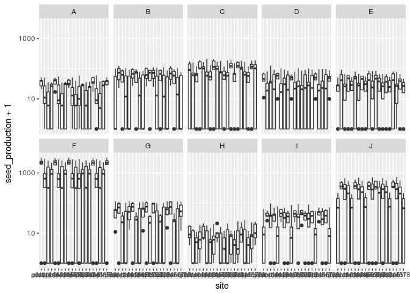
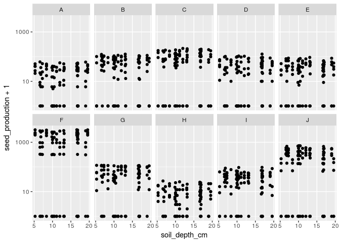

    library(tidyverse)

    ## ── Attaching packages ────────────────────────────────────────────────────────────────────────────────────────────────────────────────────────────────────────────────────────── tidyverse 1.2.1 ──

    ## ✔ ggplot2 2.2.1     ✔ purrr   0.2.4
    ## ✔ tibble  1.4.2     ✔ dplyr   0.7.4
    ## ✔ tidyr   0.8.0     ✔ stringr 1.2.0
    ## ✔ readr   1.1.1     ✔ forcats 0.2.0

    ## ── Conflicts ───────────────────────────────────────────────────────────────────────────────────────────────────────────────────────────────────────────────────────────── tidyverse_conflicts() ──
    ## ✖ dplyr::filter() masks stats::filter()
    ## ✖ dplyr::lag()    masks stats::lag()

    library(lme4)

    ## Loading required package: Matrix

    ## 
    ## Attaching package: 'Matrix'

    ## The following object is masked from 'package:tidyr':
    ## 
    ##     expand

Here I aim to simulate data in the same format as the data I will be
analyzing in this chapter. There are three major types of data,
summarized here.

### Simulate plant performance data

This will be a dataframe of the number of the performance of each
species X site X rep in the absence of competitors. Performance will be
described in two ways: 1) Raw number of seeds produced (estimated by
measuring flower-heads in the field, and using size-to-seed conversions
based on counting seeds in lab), and 2) Number of viable seeds produced.
Note that species viability will not be at the species-by-site level,
but rather at the species level. The dataframe will look something like
this:

    site  species_code  replicate num_seeds_raw num_seeds_viable
    plot_740  PLER  1 144 100
    plot_740  PLER  2 200 160
    plot_740  PLER  3 820 700
    ...

There will data from 24 sites, 17 species, and 5 replicate individuals
per species, for a total of 2040 rows.

Two important decisions need to be made: 1) What is to be made of 0s? 2)
Do seed production numbers get scaled by species? The first is important
because many species simply fail to germinate or survive to seed
production at many sites. The second may be important because the seed
production numbers span quite a large range - from 0, to thousands. It's
unclear to me whether this matters in the analysis.

In the first dataset I simulate, the seed production numbers will be
drawn from a random distribution, with a different mean per species.

    set.seed(1)
    n_species <- 10
    n_reps <- 5
    n_sites <- 20
    sp_codes <- LETTERS[1:n_species]
    # Seed viabiliities drawn from a uniform distribution
    seed_viabilities <- runif(min = 0.2, max = 0.95, n_species)
    # Mean seed production of species drawn from a lognormal, plus uniform noise
    mean_seedprod <- floor(rlnorm(10, 2, 4)+runif(min = 10, max = 100, 10))

    site_preference <- matrix(NA, nrow = n_sites, ncol = n_species)
    for(current_species in 1:ncol(site_preference)) {
      preference_vector <- c(sample(seq(from = 0.1, to = 1, by = 0.1)),
                             sample(seq(from = 0, to = 0.9, by = 0.1)))
      preference_vector[sample(1:n_sites, size = 5)] = 0
      if(max(preference_vector) != 1) {preference_vector[sample(1:20, size = 1)] = 1}
      site_preference[,current_species] <- preference_vector
    }

    seed_prod <- data.frame(site = paste0("plot_",(rep(1:n_sites, each = n_reps))),
                            replicate = rep(1:n_reps, n_sites))

    for(ii in 1:n_species){
      nsp <-rpois(n = n_reps*n_sites, lambda = mean_seedprod[ii])
      nsp <- as.numeric(floor(nsp*site_preference[,ii]))
      seed_prod <- cbind(seed_prod, nsp)
      colnames(seed_prod)[ii+2] <- LETTERS[ii]
    }

    seed_prod_long <- tidyr::gather(seed_prod, species, seed_production, A:J) %>% tbl_df %>% 
      mutate(site = as.factor(site), replicate = as.factor(replicate))

Now that we have some dummy data generated, let's plot it to explore
what the heck I just did

    gg_raw_seed <- ggplot(seed_prod_long) + geom_boxplot(aes(site,seed_production+1)) + 
      facet_wrap(~species, ncol = 5) + scale_y_log10()
    gg_raw_seed + theme_gray()

    gg_rawseed_hist <- ggplot(seed_prod_long) + geom_histogram(aes(seed_production+1))
    gg_rawseed_hist + scale_x_log10() # Note logged X-axis

    ## `stat_bin()` using `bins = 30`. Pick better value with `binwidth`.

The details are not super relevant, just that there's some distribution
of species performance by site...

### Simulating environmental data

Now, we need to simulate some environmental data for each of our sites.
**For now, these variables are all random variables- but I will update
them to reflect the distribution of the true environmental data. **

    site_data <- data.frame(site = paste0("plot_",(1:n_sites)),
                            soil_depth_cm = round(runif(min = 5, max = 20, n = n_sites),digits = 2),
                            mg_ppm = abs(rnorm(n = n_sites, mean = 10, sd = 2)))

Begin exploring models
----------------------

I need to read more of the [`lme4` package
vignette](https://cran.r-project.org/web/packages/lme4/vignettes/lmer.pdf)
before getting too deep into this.

    # Merge the data frame so that the environmental variables are added on.
    merged_df <- left_join(seed_prod_long, site_data)

    ## Joining, by = "site"

    gg_seed_v_sdep <- ggplot(merged_df) + geom_point(aes(x = soil_depth_cm, y = seed_production+1)) + 
      facet_wrap(~ species, ncol = 5) + scale_y_log10()
    gg_seed_v_sdep

    # Model seed production with species as the random effect
    lmer(data = merged_df, formula = seed_production~1|species)

    ## Linear mixed model fit by REML ['lmerMod']
    ## Formula: seed_production ~ 1 | species
    ##    Data: merged_df
    ## REML criterion at convergence: 14612.69
    ## Random effects:
    ##  Groups   Name        Std.Dev.
    ##  species  (Intercept) 357.7   
    ##  Residual             354.4   
    ## Number of obs: 1000, groups:  species, 10
    ## Fixed Effects:
    ## (Intercept)  
    ##       171.7

    # Model seed production as a function of soil depth, with species as the random effect
    lmer(data = merged_df, formula = seed_production~soil_depth_cm + (soil_depth_cm|species))

    ## Linear mixed model fit by REML ['lmerMod']
    ## Formula: seed_production ~ soil_depth_cm + (soil_depth_cm | species)
    ##    Data: merged_df
    ## REML criterion at convergence: 14606.6
    ## Random effects:
    ##  Groups   Name          Std.Dev. Corr
    ##  species  (Intercept)   307.669      
    ##           soil_depth_cm   4.058  1.00
    ##  Residual               354.142      
    ## Number of obs: 1000, groups:  species, 10
    ## Fixed Effects:
    ##   (Intercept)  soil_depth_cm  
    ##      160.0387         0.9431

The models above assume that the response variable (`seed_production`
here) is normally distributed. We can relax this with generalized linear
models, where we can allow the response to have a different family of
distribution (Poisson makes sense here).

    glmer(data = merged_df, formula = seed_production~1|species, family = poisson(link = log), control=glmerControl(optimizer="bobyqa"))

    ## Generalized linear mixed model fit by maximum likelihood (Laplace
    ##   Approximation) [glmerMod]
    ##  Family: poisson  ( log )
    ## Formula: seed_production ~ 1 | species
    ##    Data: merged_df
    ##       AIC       BIC    logLik  deviance  df.resid 
    ## 179443.75 179453.56 -89719.87 179439.75       998 
    ## Random effects:
    ##  Groups  Name        Std.Dev.
    ##  species (Intercept) 1.335   
    ## Number of obs: 1000, groups:  species, 10
    ## Fixed Effects:
    ## (Intercept)  
    ##       4.006

    # glmer(data = merged_df, formula = seed_production~soil_depth_cm + (soil_depth_cm|species), family = poisson(link = log), control=glmerControl(optimizer="bobyqa"))

To Do
-----

Need to think about how to bring in species traits. But I think it
doesn't make much sense to do that quite yet- will focus instead on
trying to repeat these steps so far with the actual data.
