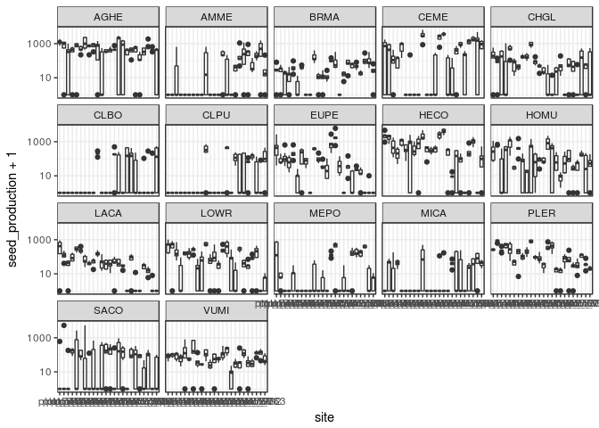

Here I begin to recreate the dummy analyses presented in [this
document](dummy-dataset-analysis.md)

    library(tidyverse); theme_set(theme_bw())

    ## ── Attaching packages ────────────────────────────────────────────────────────────── tidyverse 1.2.1 ──

    ## ✔ ggplot2 2.2.1     ✔ purrr   0.2.4
    ## ✔ tibble  1.4.2     ✔ dplyr   0.7.4
    ## ✔ tidyr   0.8.0     ✔ stringr 1.2.0
    ## ✔ readr   1.1.1     ✔ forcats 0.2.0

    ## ── Conflicts ───────────────────────────────────────────────────────────────── tidyverse_conflicts() ──
    ## ✖ dplyr::filter() masks stats::filter()
    ## ✖ dplyr::lag()    masks stats::lag()

    library(lme4)

    ## Loading required package: Matrix

    ## 
    ## Attaching package: 'Matrix'

    ## The following object is masked from 'package:tidyr':
    ## 
    ##     expand

    library(vegan)

    ## Loading required package: permute

    ## Loading required package: lattice

    ## This is vegan 2.4-6

    library(glmmTMB)
    library(bbmle)

    ## Loading required package: stats4

    ## 
    ## Attaching package: 'bbmle'

    ## The following object is masked from 'package:dplyr':
    ## 
    ##     slice

Let's import in the performance data and clean it up to our needs.

    if(thinkpad){
      dat <- read_delim("../data/performance/seed_production_processed.csv", 
                      col_names = T, delim = ",")
    } else {
      dat <- read_delim("~/Dropbox/spatial_tapioca/data/performance/seed_production_processed.csv", 
                        col_names = T, delim = ",")
    }

    ## Parsed with column specification:
    ## cols(
    ##   plot_num = col_integer(),
    ##   plot_type = col_character(),
    ##   replicate = col_integer(),
    ##   sp_code = col_character(),
    ##   num_seeds_produced = col_integer()
    ## )

    ## Warning in rbind(names(probs), probs_f): number of columns of result is not
    ## a multiple of vector length (arg 1)

    ## Warning: 21 parsing failures.
    ## row # A tibble: 5 x 5 col     row col                expected               actual file              expected   <int> <chr>              <chr>                  <chr>  <chr>             actual 1  1157 num_seeds_produced no trailing characters .6664  '../data/perform… file 2  1195 num_seeds_produced no trailing characters .9858  '../data/perform… row 3  1197 num_seeds_produced no trailing characters .5     '../data/perform… col 4  1206 num_seeds_produced no trailing characters .25    '../data/perform… expected 5  1208 num_seeds_produced no trailing characters .22    '../data/perform…
    ## ... ................. ... .......................................................................... ........ .......................................................................... ...... .......................................................................... .... .......................................................................... ... .......................................................................... ... .......................................................................... ........ ..........................................................................
    ## See problems(...) for more details.

    dat <- dat %>% filter(plot_type == "L") %>% 
      mutate(plot_num = paste0("plot_", plot_num),
                   replicate = as.factor(replicate),
                   num_seeds_produced = ifelse(is.na(num_seeds_produced), 0, num_seeds_produced)) %>%
      rename(species = sp_code, seed_production = num_seeds_produced, site = plot_num) %>% select(-plot_type)

    dat

    ## # A tibble: 2,083 x 4
    ##    site     replicate species seed_production
    ##    <chr>    <fct>     <chr>             <dbl>
    ##  1 plot_740 1         AGHE                768
    ##  2 plot_740 2         AGHE               1206
    ##  3 plot_740 3         AGHE               1425
    ##  4 plot_740 4         AGHE               1864
    ##  5 plot_740 5         AGHE               1425
    ##  6 plot_740 6         AGHE                987
    ##  7 plot_741 1         AGHE               1206
    ##  8 plot_741 2         AGHE                987
    ##  9 plot_741 3         AGHE                548
    ## 10 plot_741 4         AGHE               1206
    ## # ... with 2,073 more rows

    gg_raw_seed <- ggplot(dat) + geom_boxplot(aes(site,seed_production+1)) + 
      facet_wrap(~species, ncol = 5) + scale_y_log10()
    gg_raw_seed

    gg_rawseed_hist <- ggplot(dat) + geom_histogram(aes(seed_production+1))
    gg_rawseed_hist + scale_x_log10() # Note logged X-axis

    ## `stat_bin()` using `bins = 30`. Pick better value with `binwidth`.

Now we import the environmental data

    if(thinkpad){
      env_dat <- read_delim("../data/environmental/all_environmental_data.csv", delim = ",")
    } else {
      env_dat <- read_delim("~/Dropbox/spatial_tapioca/data/environmental/all_environmental_data.csv",
                            delim = ",") 
    }

    ## Parsed with column specification:
    ## cols(
    ##   .default = col_double(),
    ##   plot = col_integer(),
    ##   type = col_character(),
    ##   organic_matter_ENR = col_integer(),
    ##   Nitrate_ppm = col_integer(),
    ##   sand = col_integer(),
    ##   clay = col_integer(),
    ##   microsite = col_character()
    ## )

    ## See spec(...) for full column specifications.

    env_dat <- env_dat %>% rename(site = plot) %>% mutate(site = paste0("plot_", site))
    # skimr::skim(env_dat) %>% select(-missing, -complete, -n)

    plot(env_dat %>% select(-site, -lat, -lon, -type, - microsite, -ele), 
         pch = 21, bg = alpha("black", .25))

Before going too far into the models, let's do an NMDS- there's a lot of
soil variables to consider, so it might be wise to reduce dimensionality
if there are colinear columns.

    # Subset the dataset to filter out some of the columns that are factors, or are repetitive...
    env_dat_c <- env_dat %>% select(-type, -microsite, -lat, -lon, -Tmin, -ele) %>% 
      as.data.frame %>% tibble::column_to_rownames("site") 
    soilmds <- metaMDS(env_dat_c)

    ## Square root transformation
    ## Wisconsin double standardization
    ## Run 0 stress 0.09565685 
    ## Run 1 stress 0.09983745 
    ## Run 2 stress 0.1528405 
    ## Run 3 stress 0.1063597 
    ## Run 4 stress 0.09983743 
    ## Run 5 stress 0.09565687 
    ## ... Procrustes: rmse 4.203246e-05  max resid 8.158366e-05 
    ## ... Similar to previous best
    ## Run 6 stress 0.1063597 
    ## Run 7 stress 0.1063597 
    ## Run 8 stress 0.09983736 
    ## Run 9 stress 0.09565685 
    ## ... Procrustes: rmse 1.046536e-05  max resid 2.464361e-05 
    ## ... Similar to previous best
    ## Run 10 stress 0.09565685 
    ## ... New best solution
    ## ... Procrustes: rmse 6.185339e-06  max resid 1.216053e-05 
    ## ... Similar to previous best
    ## Run 11 stress 0.09565685 
    ## ... Procrustes: rmse 5.818232e-06  max resid 1.13022e-05 
    ## ... Similar to previous best
    ## Run 12 stress 0.1063597 
    ## Run 13 stress 0.1063597 
    ## Run 14 stress 0.1374202 
    ## Run 15 stress 0.1063597 
    ## Run 16 stress 0.09565685 
    ## ... Procrustes: rmse 2.397106e-05  max resid 4.760987e-05 
    ## ... Similar to previous best
    ## Run 17 stress 0.0998374 
    ## Run 18 stress 0.1572407 
    ## Run 19 stress 0.1057252 
    ## Run 20 stress 0.09565685 
    ## ... Procrustes: rmse 1.259869e-05  max resid 2.432769e-05 
    ## ... Similar to previous best
    ## *** Solution reached

    plot(soilmds)
    orditorp(soilmds, display="species", cex = 1.2)

    plot(soilmds)
    orditorp(soilmds, display="sites")

    # Merge in the MDS scores into the env_dat dataframe
    env_dat <- left_join(env_dat, soilmds$points %>% as.data.frame %>% tibble::rownames_to_column("site"))

    ## Joining, by = "site"

    # Take a look at what the distribution looks like. 
    # skimr::skim(env_dat %>% select(MDS1, MDS2))
    # Merge in the environmental data with the performance-by-site data, for easier modeling later. 
    merged_df <- left_join(dat, env_dat)

    ## Joining, by = "site"

Let's do some exploratory plotting of seed production vs. environmental
factors

    gg_seed <- ggplot(merged_df, aes(y = seed_production+1)) + 
      facet_wrap(~ species, ncol = 5) + scale_y_log10()

    gg_seed + geom_point(aes(x = depth))
    gg_seed + geom_point(aes(x = Tmax))
    gg_seed + geom_point(aes(x = organic_matter_ENR))
    gg_seed + geom_point(aes(x = pH))
    gg_seed + geom_point(aes(x = CEC_meq_100g))
    gg_seed + geom_point(aes(x = soil_moisture))
    gg_seed + geom_point(aes(x = Nitrate_ppm))
    gg_seed + geom_point(aes(x = Mg_ppm))
    gg_seed + geom_point(aes(x = Ca_ppm))
    gg_seed + geom_point(aes(x = sand))
    gg_seed + geom_point(aes(x = NH4_N_ppm))
    gg_seed + geom_point(aes(x = MDS1))
    gg_seed + geom_point(aes(x = MDS2))

And let's do a first pass on modeling seed production as a function of
each environmental variable independently.

    glmer(data = merged_df, formula = seed_production~depth + (1|species), family = poisson(link = log))
    glmer(data = merged_df, formula = seed_production~Tmax + (1|species), family = poisson(link = log))
    glmer(data = merged_df, formula = seed_production~organic_matter_ENR + (1|species), family = poisson(link = log))
    glmer(data = merged_df, formula = seed_production~pH + (1|species), family = poisson(link = log))
    glmer(data = merged_df, formula = seed_production~CEC_meq_100g + (1|species), family = poisson(link = log))
    glmer(data = merged_df, formula = seed_production~soil_moisture + (1|species), family = poisson(link = log))
    glmer(data = merged_df, formula = seed_production~Nitrate_ppm + (1|species), family = poisson(link = log))
    glmer(data = merged_df, formula = seed_production~Mg_ppm + (1|species), family = poisson(link = log))
    glmer(data = merged_df, formula = seed_production~Ca_ppm + (1|species), family = poisson(link = log))
    glmer(data = merged_df, formula = seed_production~sand + (1|species), family = poisson(link = log))
    glmer(data = merged_df, formula = seed_production~NH4_N_ppm + (1|species), family = poisson(link = log))
    a <- glmer(data = merged_df, formula = seed_production~MDS1 + (seed_production|species), family = poisson(link = log))
    b <- glmer(data = merged_df, formula = seed_production~MDS2 + (1|species), family = poisson(link = log))

An alternative (and I'm not sure at this stage which is the better
approach to this problem) is to do a complete model.

    scale_this <- function(x) as.vector(scale(x))

    merged_df_s <- merged_df %>% mutate_at(c(9:21, 23), scale_this)
    aghe <- merged_df_s %>% filter(species == "AGHE")
    amme <- merged_df_s %>% filter(species == "AMME")
    a <- glmer(data = aghe, formula = seed_production ~ MDS1 + (1|replicate),
               family = poisson,control = glmerControl(optimizer ="Nelder_Mead"))
    b <- glmer(data = amme, formula = seed_production ~ MDS1 + (1|replicate),
               family = poisson,control = glmerControl(optimizer ="Nelder_Mead"))

I think I need to take a step back.
===================================

There's a ton of complexity in these models and I'm getting a little
overwhelmed by the number of options. So I want to take a step back and
break down what I am trying to do here.

The core question for this portion of the analysis is **whether seed
production responds to site-variation, and whether species differ in
their responses**. Let's break things down and focus on this question,
without worrying about environmental variation for now.

I will go back to the data frame `dat`, which has the following
structure:

    dat %>% head

    ## # A tibble: 6 x 4
    ##   site     replicate species seed_production
    ##   <chr>    <fct>     <chr>             <dbl>
    ## 1 plot_740 1         AGHE                768
    ## 2 plot_740 2         AGHE               1206
    ## 3 plot_740 3         AGHE               1425
    ## 4 plot_740 4         AGHE               1864
    ## 5 plot_740 5         AGHE               1425
    ## 6 plot_740 6         AGHE                987

Remember from above that `seed_production` is count data and, based on
the histogram, seems to have a zero-inflation problem. I will use the
modeling functionality in the package **`glmmTMB`** to tackle this
dataset.

    # First, a poisson model with species and plot as fixed effect, replicate as random effect  

    # The zero-eth model just has a species effect and no site effect
    pm0 = glmmTMB(seed_production~species + (1|replicate), dat, family=poisson)
    pm1 = glmmTMB(seed_production~species + site + (1|replicate), dat, family=poisson)

    ## Warning in fitTMB(TMBStruc): Model convergence problem; iteration limit
    ## reached without convergence (10). See vignette('troubleshooting')

    pm2 = glmmTMB(seed_production~species * site + (1|replicate), dat, family=poisson)

    ## Warning in fitTMB(TMBStruc): Model convergence problem; non-positive-
    ## definite Hessian matrix. See vignette('troubleshooting')

    ## Warning in fitTMB(TMBStruc): Model convergence problem; iteration limit
    ## reached without convergence (10). See vignette('troubleshooting')

    nb0 = glmmTMB(seed_production~species + (1|replicate), dat, family=nbinom2)
    nb1 = glmmTMB(seed_production~species + site + (1|replicate), dat, family=nbinom2)
    nb2 = glmmTMB(seed_production~species * site + (1|replicate), dat, family=nbinom2)

    ## Warning in fitTMB(TMBStruc): Model convergence problem; extreme or very
    ## small eigen values detected. See vignette('troubleshooting')

    ## Warning in fitTMB(TMBStruc): Model convergence problem; singular
    ## convergence (7). See vignette('troubleshooting')

    zipm0 = glmmTMB(seed_production~species +(1|replicate), zi=~species, dat, family=poisson)
    zipm0nb = glmmTMB(seed_production~species +(1|replicate), zi=~species, dat, family=nbinom2)
    zipm1nb = glmmTMB(seed_production~species + site +(1|replicate), zi=~species, dat, family=nbinom2)
    zipm2nb = glmmTMB(seed_production~species + site +(1|replicate), zi=~species + site, dat, family=nbinom2)
    zipm3nb = glmmTMB(seed_production~species * site +(1|replicate), zi=~species + site, dat, family=nbinom2)

    ## Warning in nlminb(start = par, objective = fn, gradient = gr, control =
    ## control$optCtrl): NA/NaN function evaluation

    ## Warning in fitTMB(TMBStruc): Model convergence problem; non-positive-
    ## definite Hessian matrix. See vignette('troubleshooting')

    ## Warning in fitTMB(TMBStruc): Model convergence problem; iteration limit
    ## reached without convergence (10). See vignette('troubleshooting')

    zipm4nb = glmmTMB(seed_production~species * site +(1|replicate), zi=~species * site, dat, family=nbinom2)

    ## Warning in fitTMB(TMBStruc): Model convergence problem; non-positive-
    ## definite Hessian matrix. See vignette('troubleshooting')

    ## Warning in fitTMB(TMBStruc): Model convergence problem; iteration limit
    ## reached without convergence (10). See vignette('troubleshooting')

    aic_table <- bbmle::AICtab(pm0, pm1, pm2, 
                  nb0,nb1,nb2,
                  zipm0, 
                  zipm0nb, zipm1nb,zipm2nb, zipm3nb, zipm4nb)
    aic_table

    ##         dAIC     df 
    ## zipm2nb      0.0 82 
    ## zipm1nb     74.8 59 
    ## nb2        447.1 410
    ## zipm0nb    674.4 36 
    ## nb1       1703.2 42 
    ## nb0       1904.5 19 
    ## zipm0   529172.6 35 
    ## pm1     576147.9 41 
    ## pm0     871068.5 18 
    ## pm2           NA 409
    ## zipm3nb       NA 450
    ## zipm4nb       NA 818

According to the AIC table above it looks like the model zipm2nb has the
lowest AIC and therefore the most support in this framework. A good
thing to check at this point is whether the same result holds if we
*scale* the performance data (so that the per-species mean is 0 and the
per-species SD = 1)

    # Scale by species
    # Define a custom function to scale
    scale_this <- function(x) as.vector(scale(x))

    dat_scaled <- dat %>% tidyr::spread(species, seed_production) %>% 
      mutate_if(is.numeric, scale_this) %>% 
      unite(id, c("site", "replicate"), sep = "XX") %>%
      tidyr::gather("species", "seed_production",2:18) %>% 
      separate(id, c("site", "replicate"), sep = "XX")

    dat_scaled

    ## # A tibble: 2,482 x 4
    ##    site     replicate species seed_production
    ##    <chr>    <chr>     <chr>             <dbl>
    ##  1 plot_740 1         AGHE              0.278
    ##  2 plot_740 2         AGHE              1.07 
    ##  3 plot_740 3         AGHE              1.47 
    ##  4 plot_740 4         AGHE              2.27 
    ##  5 plot_740 5         AGHE              1.47 
    ##  6 plot_740 6         AGHE              0.675
    ##  7 plot_741 1         AGHE              1.07 
    ##  8 plot_741 2         AGHE              0.675
    ##  9 plot_741 3         AGHE             -0.121
    ## 10 plot_741 4         AGHE              1.07 
    ## # ... with 2,472 more rows

    pm0_s = glmmTMB(seed_production~species + (1|replicate), dat_scaled)
    pm1_s = glmmTMB(seed_production~species + site + (1|replicate), dat_scaled)
    pm2_s = glmmTMB(seed_production~species * site + (1|replicate), dat_scaled)
    nb0_s = glmmTMB(seed_production~species + (1|replicate), dat_scaled)
    nb1_s = glmmTMB(seed_production~species + site + (1|replicate), dat_scaled)
    nb2_s = glmmTMB(seed_production~species * site + (1|replicate), dat_scaled)
    zipm0_s = glmmTMB(seed_production~species +(1|replicate), zi=~species, dat_scaled)
    zipm1_s = glmmTMB(seed_production~species + site +(1|replicate), zi=~species, dat_scaled)
    zipm2_s = glmmTMB(seed_production~species + site +(1|replicate), zi=~species + site, dat_scaled)

    aic_table2 <- bbmle::AICtab(pm0_s, pm1_s, pm2_s, 
                  nb0_s,nb1_s,nb2_s,
                  zipm0_s, zipm1_s, zipm2_s)
    aic_table2

    ##         dAIC  df 
    ## pm2_s     0.0 410
    ## nb2_s     0.0 410
    ## pm1_s   478.9 42 
    ## nb1_s   478.9 42 
    ## zipm1_s 512.9 59 
    ## zipm2_s 558.9 82 
    ## pm0_s   876.1 19 
    ## nb0_s   876.1 19 
    ## zipm0_s 910.1 36

And for measure, let's also consider seed production as a *proportion*,
i.e. where the seed performance for a species is equal to 1 at it's
maximum seed performance

    # Scale by species
    # Define a custom function to scale
    prop_this <- function(x) as.vector(x/(max(x, na.rm = T)))

    dat_prop <- dat %>% tidyr::spread(species, seed_production) %>% 
      mutate_if(is.numeric, prop_this) %>% 
      unite(id, c("site", "replicate"), sep = "XX") %>%
      tidyr::gather("species", "seed_production",2:18) %>% 
      separate(id, c("site", "replicate"), sep = "XX")

    dat_prop

    ## # A tibble: 2,482 x 4
    ##    site     replicate species seed_production
    ##    <chr>    <chr>     <chr>             <dbl>
    ##  1 plot_740 1         AGHE              0.269
    ##  2 plot_740 2         AGHE              0.423
    ##  3 plot_740 3         AGHE              0.500
    ##  4 plot_740 4         AGHE              0.654
    ##  5 plot_740 5         AGHE              0.500
    ##  6 plot_740 6         AGHE              0.346
    ##  7 plot_741 1         AGHE              0.423
    ##  8 plot_741 2         AGHE              0.346
    ##  9 plot_741 3         AGHE              0.192
    ## 10 plot_741 4         AGHE              0.423
    ## # ... with 2,472 more rows

    pm0_p = glmmTMB(seed_production~species + (1|replicate), dat, family=poisson)
    pm1_p = glmmTMB(seed_production~species + site + (1|replicate), dat, family=poisson)

    ## Warning in fitTMB(TMBStruc): Model convergence problem; iteration limit
    ## reached without convergence (10). See vignette('troubleshooting')

    pm2_p = glmmTMB(seed_production~species * site + (1|replicate), dat, family=poisson)

    ## Warning in fitTMB(TMBStruc): Model convergence problem; non-positive-
    ## definite Hessian matrix. See vignette('troubleshooting')

    ## Warning in fitTMB(TMBStruc): Model convergence problem; iteration limit
    ## reached without convergence (10). See vignette('troubleshooting')

    nb0_p = glmmTMB(seed_production~species + (1|replicate), dat, family=nbinom2)
    nb1_p = glmmTMB(seed_production~species + site + (1|replicate), dat, family=nbinom2)
    nb2_p = glmmTMB(seed_production~species * site + (1|replicate), dat, family=nbinom2)

    ## Warning in fitTMB(TMBStruc): Model convergence problem; extreme or very
    ## small eigen values detected. See vignette('troubleshooting')

    ## Warning in fitTMB(TMBStruc): Model convergence problem; singular
    ## convergence (7). See vignette('troubleshooting')

    zipm0_p = glmmTMB(seed_production~species +(1|replicate), zi=~species, dat, family=poisson)
    zipm0nb_p = glmmTMB(seed_production~species +(1|replicate), zi=~species, dat, family=nbinom2)
    zipm1nb_p = glmmTMB(seed_production~species + site +(1|replicate), zi=~species, dat, family=nbinom2)
    zipm2nb_p = glmmTMB(seed_production~species + site +(1|replicate), zi=~species + site, dat, family=nbinom2)

    aic_table3 <- bbmle::AICtab(pm0_p, pm1_p, pm2_p, 
                  nb0_p,nb1_p,nb2_p,
                  zipm0_p, 
                  zipm0nb_p, zipm1nb_p,zipm2nb_p)
    aic_table3

    ##           dAIC     df 
    ## zipm2nb_p      0.0 82 
    ## zipm1nb_p     74.8 59 
    ## nb2_p        447.1 410
    ## zipm0nb_p    674.4 36 
    ## nb1_p       1703.2 42 
    ## nb0_p       1904.5 19 
    ## zipm0_p   529172.6 35 
    ## pm1_p     576147.9 41 
    ## pm0_p     871068.5 18 
    ## pm2_p           NA 409

Zero inflated with environmental predictors
-------------------------------------------

    a <- glmmTMB(seed_production~MDS1+(seed_production|species), data = merged_df, family=nbinom2, zi=~species)
    b <- glmmTMB(seed_production~MDS1+(1|species), data = merged_df, family=nbinom2, zi=~species)
    c <- glmmTMB(seed_production~depth+Tmax+organic_matter_ENR+pH+CEC_meq_100g+soil_moisture+
            Nitrate_ppm + Mg_ppm + Ca_ppm + sand + NH4_N_ppm + MDS1 + MDS2+(seed_production|species), 
            data = merged_df, family=nbinom2, zi=~species)

    bbmle::AICtab(a,b,c)

    ##   dAIC   df
    ## c    0.0 35
    ## a   77.0 23
    ## b 1782.9 21

    ranef(c)

    ## $species
    ##      (Intercept) seed_production
    ## AGHE   0.3311636    0.0009483931
    ## AMME  -0.9013571    0.0027919413
    ## BRMA  -2.2442691    0.0099680939
    ## CEME   0.3982707    0.0007336904
    ## CHGL  -1.3115384    0.0036446770
    ## CLBO  -0.9760485    0.0042191082
    ## CLPU  -0.8261858    0.0033040413
    ## EUPE  -1.0901737    0.0019310878
    ## HECO   0.1811421    0.0008023471
    ## HOMU  -1.1078174    0.0026420239
    ## LACA  -1.8569833    0.0066719855
    ## LOWR  -1.2382729    0.0038354633
    ## MEPO  -1.6757610    0.0054726402
    ## MICA  -1.7297532    0.0069346780
    ## PLER  -1.3803452    0.0038360508
    ## SACO  -0.2449721    0.0008320720
    ## VUMI  -1.6807345    0.0060126957

    c

    ## Formula:          
    ## seed_production ~ depth + Tmax + organic_matter_ENR + pH + CEC_meq_100g +  
    ##     soil_moisture + Nitrate_ppm + Mg_ppm + Ca_ppm + sand + NH4_N_ppm +  
    ##     MDS1 + MDS2 + (seed_production | species)
    ## Zero inflation:                   ~species
    ## Data: merged_df
    ##       AIC       BIC    logLik  df.resid 
    ## 18020.725 18218.180 -8975.363      2048 
    ## Random-effects (co)variances:
    ## 
    ## Conditional model:
    ##  Groups  Name            Std.Dev. Corr  
    ##  species (Intercept)     1.277152       
    ##          seed_production 0.004593 -0.96 
    ## 
    ## Number of obs: 2083 / Conditional model: species, 17
    ## 
    ## Overdispersion parameter for nbinom2 family (): 3.27 
    ## 
    ## Fixed Effects:
    ## 
    ## Conditional model:
    ##        (Intercept)               depth                Tmax  
    ##           5.132220            0.003170           -0.021866  
    ## organic_matter_ENR                  pH        CEC_meq_100g  
    ##           0.001392            0.646990           -0.004589  
    ##      soil_moisture         Nitrate_ppm              Mg_ppm  
    ##           1.140128           -0.022097           -0.029415  
    ##             Ca_ppm                sand           NH4_N_ppm  
    ##          -0.046481           -0.006204           -0.057193  
    ##               MDS1                MDS2  
    ##           1.928333           -0.387486  
    ## 
    ## Zero-inflation model:
    ## (Intercept)  speciesAMME  speciesBRMA  speciesCEME  speciesCHGL  
    ##     -1.8112       2.3132       0.4992       1.4057       0.8300  
    ## speciesCLBO  speciesCLPU  speciesEUPE  speciesHECO  speciesHOMU  
    ##      3.1566       2.7805       0.6498       0.1918       0.1916  
    ## speciesLACA  speciesLOWR  speciesMEPO  speciesMICA  speciesPLER  
    ##      0.5711       0.4737       2.1614       2.5163      -1.5960  
    ## speciesSACO  speciesVUMI  
    ##      1.9233      -0.9010

    newdata0 = newdata = unique(merged_df[,c("species", "MDS1")])
    temp = predict(a, merged_df)

Time to do some linear models
-----------------------------

    slopes <- matrix(NA, nrow = length(unique(merged_df$species)), ncol = 15)
    rownames(slopes) = unique(merged_df$species)
    colnames(slopes) = colnames(merged_df)[c(9:21, 24, 25)]
    pvals <- slopes
    for(current_species in unique(merged_df$species)){
      current_df <- merged_df_s %>% 
        filter(species == !!current_species) %>% 
        mutate(seed_production = scale(seed_production)) %>%
        select(-microsite)
      print(nrow(current_df))
      
      for (current_env in colnames(slopes)) {
        sp <- current_df %>% select(seed_production) %>% unlist
        env <- current_df %>% select(!!current_env) %>% unlist
        ll <- lm(sp~env)
        slopes[current_species, current_env] <- ll$coefficients[2]
        pvals[current_species,current_env] <- anova(ll)$`Pr(>F)`[1]
      }
    }

    ## [1] 121
    ## [1] 122
    ## [1] 122
    ## [1] 120
    ## [1] 121
    ## [1] 120
    ## [1] 121
    ## [1] 130
    ## [1] 121
    ## [1] 121
    ## [1] 120
    ## [1] 125
    ## [1] 121
    ## [1] 121
    ## [1] 124
    ## [1] 125
    ## [1] 128

    knitr::kable(slopes)

<table>
<thead>
<tr class="header">
<th></th>
<th align="right">Tmax</th>
<th align="right">Tmin</th>
<th align="right">organic_matter_ENR</th>
<th align="right">pH</th>
<th align="right">CEC_meq_100g</th>
<th align="right">K_ppm</th>
<th align="right">Mg_ppm</th>
<th align="right">Ca_ppm</th>
<th align="right">NH4_N_ppm</th>
<th align="right">Nitrate_ppm</th>
<th align="right">soil_moisture</th>
<th align="right">sand</th>
<th align="right">clay</th>
<th align="right">MDS1</th>
<th align="right">MDS2</th>
</tr>
</thead>
<tbody>
<tr class="odd">
<td>AGHE</td>
<td align="right">0.0489581</td>
<td align="right">-0.0716425</td>
<td align="right">-0.1509569</td>
<td align="right">0.3230788</td>
<td align="right">0.1497983</td>
<td align="right">-0.1869018</td>
<td align="right">0.2260924</td>
<td align="right">-0.1908143</td>
<td align="right">-0.0002652</td>
<td align="right">0.0591335</td>
<td align="right">0.0203364</td>
<td align="right">-0.2054152</td>
<td align="right">0.3330813</td>
<td align="right">-2.5525936</td>
<td align="right">-3.7704699</td>
</tr>
<tr class="even">
<td>AMME</td>
<td align="right">-0.3567436</td>
<td align="right">0.0743390</td>
<td align="right">0.2696532</td>
<td align="right">-0.0976949</td>
<td align="right">-0.2417218</td>
<td align="right">0.4923944</td>
<td align="right">-0.4386214</td>
<td align="right">0.4319975</td>
<td align="right">-0.2950262</td>
<td align="right">0.4237752</td>
<td align="right">0.1080555</td>
<td align="right">0.0611714</td>
<td align="right">-0.1782167</td>
<td align="right">5.3661457</td>
<td align="right">-3.3597468</td>
</tr>
<tr class="odd">
<td>BRMA</td>
<td align="right">-0.1635973</td>
<td align="right">0.0070023</td>
<td align="right">0.0833322</td>
<td align="right">0.1610042</td>
<td align="right">-0.0240896</td>
<td align="right">0.2413616</td>
<td align="right">-0.1838070</td>
<td align="right">0.2064280</td>
<td align="right">-0.2015993</td>
<td align="right">0.2838627</td>
<td align="right">-0.0033719</td>
<td align="right">-0.0872690</td>
<td align="right">0.0853136</td>
<td align="right">2.2166925</td>
<td align="right">-5.9725824</td>
</tr>
<tr class="even">
<td>CEME</td>
<td align="right">-0.1257877</td>
<td align="right">0.0567134</td>
<td align="right">-0.0250671</td>
<td align="right">0.3692839</td>
<td align="right">0.1007556</td>
<td align="right">0.0999685</td>
<td align="right">-0.1429523</td>
<td align="right">0.1963775</td>
<td align="right">-0.1400807</td>
<td align="right">0.2220082</td>
<td align="right">0.0298438</td>
<td align="right">-0.1448566</td>
<td align="right">0.1819757</td>
<td align="right">1.1924007</td>
<td align="right">-6.8576428</td>
</tr>
<tr class="odd">
<td>CLBO</td>
<td align="right">-0.0027580</td>
<td align="right">-0.0570088</td>
<td align="right">-0.0809434</td>
<td align="right">-0.1997580</td>
<td align="right">-0.1784584</td>
<td align="right">0.1200592</td>
<td align="right">-0.2038542</td>
<td align="right">0.1638202</td>
<td align="right">-0.1120986</td>
<td align="right">-0.0348239</td>
<td align="right">-0.1638758</td>
<td align="right">0.0650195</td>
<td align="right">-0.0650162</td>
<td align="right">1.6633507</td>
<td align="right">0.3357875</td>
</tr>
<tr class="even">
<td>CLPU</td>
<td align="right">-0.0624090</td>
<td align="right">-0.0300141</td>
<td align="right">0.0273367</td>
<td align="right">0.1027439</td>
<td align="right">0.0004188</td>
<td align="right">0.0199642</td>
<td align="right">-0.1922499</td>
<td align="right">0.2042812</td>
<td align="right">-0.1275626</td>
<td align="right">0.0795507</td>
<td align="right">0.0217878</td>
<td align="right">0.0782700</td>
<td align="right">-0.0518732</td>
<td align="right">1.7444148</td>
<td align="right">-1.8992000</td>
</tr>
<tr class="odd">
<td>CHGL</td>
<td align="right">0.1616355</td>
<td align="right">0.0315657</td>
<td align="right">-0.0099653</td>
<td align="right">0.1450848</td>
<td align="right">-0.0381343</td>
<td align="right">-0.0519602</td>
<td align="right">0.1835541</td>
<td align="right">-0.1685311</td>
<td align="right">-0.0935314</td>
<td align="right">-0.0712969</td>
<td align="right">-0.0695492</td>
<td align="right">0.1632143</td>
<td align="right">-0.0724036</td>
<td align="right">-0.9678292</td>
<td align="right">2.0808037</td>
</tr>
<tr class="even">
<td>EUPE</td>
<td align="right">-0.0859148</td>
<td align="right">0.1489122</td>
<td align="right">-0.0379042</td>
<td align="right">0.2763266</td>
<td align="right">0.2148662</td>
<td align="right">-0.2095594</td>
<td align="right">0.1741124</td>
<td align="right">-0.1419938</td>
<td align="right">0.2303685</td>
<td align="right">0.1739796</td>
<td align="right">0.0957843</td>
<td align="right">-0.2256795</td>
<td align="right">0.3118731</td>
<td align="right">-2.1865408</td>
<td align="right">-4.3671449</td>
</tr>
<tr class="odd">
<td>HECO</td>
<td align="right">0.0273318</td>
<td align="right">0.0299076</td>
<td align="right">-0.1120724</td>
<td align="right">0.4625187</td>
<td align="right">0.3680887</td>
<td align="right">-0.3445998</td>
<td align="right">0.3326250</td>
<td align="right">-0.2742910</td>
<td align="right">0.2335339</td>
<td align="right">0.1537998</td>
<td align="right">0.0937293</td>
<td align="right">-0.3308834</td>
<td align="right">0.5364122</td>
<td align="right">-4.0539389</td>
<td align="right">-5.7785927</td>
</tr>
<tr class="even">
<td>HOMU</td>
<td align="right">-0.0192091</td>
<td align="right">-0.0534120</td>
<td align="right">-0.0382257</td>
<td align="right">0.2447712</td>
<td align="right">0.2490014</td>
<td align="right">-0.1880066</td>
<td align="right">0.2787329</td>
<td align="right">-0.2463107</td>
<td align="right">0.2263580</td>
<td align="right">0.0841161</td>
<td align="right">0.1290249</td>
<td align="right">-0.2665884</td>
<td align="right">0.3554502</td>
<td align="right">-2.9006708</td>
<td align="right">-3.4043411</td>
</tr>
<tr class="odd">
<td>LACA</td>
<td align="right">0.2115963</td>
<td align="right">-0.1285069</td>
<td align="right">-0.0625730</td>
<td align="right">0.1995355</td>
<td align="right">0.2424924</td>
<td align="right">-0.2782785</td>
<td align="right">0.3464370</td>
<td align="right">-0.3277599</td>
<td align="right">0.1522081</td>
<td align="right">0.0071961</td>
<td align="right">0.1057188</td>
<td align="right">-0.2484344</td>
<td align="right">0.3609953</td>
<td align="right">-3.8521306</td>
<td align="right">-1.9004641</td>
</tr>
<tr class="even">
<td>LOWR</td>
<td align="right">0.1127693</td>
<td align="right">-0.2225888</td>
<td align="right">-0.1006626</td>
<td align="right">0.3031619</td>
<td align="right">0.4217627</td>
<td align="right">-0.3254549</td>
<td align="right">0.3073767</td>
<td align="right">-0.2713779</td>
<td align="right">0.1197301</td>
<td align="right">0.0736200</td>
<td align="right">0.1045963</td>
<td align="right">-0.3639256</td>
<td align="right">0.5346179</td>
<td align="right">-3.8339885</td>
<td align="right">-6.7686896</td>
</tr>
<tr class="odd">
<td>MEPO</td>
<td align="right">-0.2561153</td>
<td align="right">-0.1000005</td>
<td align="right">0.1715437</td>
<td align="right">0.3713785</td>
<td align="right">0.2298950</td>
<td align="right">0.0037543</td>
<td align="right">-0.2260815</td>
<td align="right">0.2856712</td>
<td align="right">-0.0919384</td>
<td align="right">0.2947910</td>
<td align="right">0.3134295</td>
<td align="right">-0.2211872</td>
<td align="right">0.3122683</td>
<td align="right">1.6790297</td>
<td align="right">-7.3957936</td>
</tr>
<tr class="even">
<td>MICA</td>
<td align="right">-0.0544140</td>
<td align="right">-0.0956990</td>
<td align="right">-0.0306307</td>
<td align="right">-0.1130650</td>
<td align="right">-0.1277774</td>
<td align="right">0.2037172</td>
<td align="right">-0.1822984</td>
<td align="right">0.1591848</td>
<td align="right">-0.2533008</td>
<td align="right">0.0673698</td>
<td align="right">-0.0632010</td>
<td align="right">-0.0055679</td>
<td align="right">-0.0623651</td>
<td align="right">2.0094762</td>
<td align="right">-2.4907342</td>
</tr>
<tr class="odd">
<td>PLER</td>
<td align="right">0.0447051</td>
<td align="right">-0.1666497</td>
<td align="right">-0.0931961</td>
<td align="right">0.2863526</td>
<td align="right">0.3592257</td>
<td align="right">-0.3233354</td>
<td align="right">0.3941356</td>
<td align="right">-0.3586183</td>
<td align="right">0.1813887</td>
<td align="right">0.0814507</td>
<td align="right">0.1517180</td>
<td align="right">-0.3006826</td>
<td align="right">0.4383025</td>
<td align="right">-4.2499146</td>
<td align="right">-3.8960665</td>
</tr>
<tr class="even">
<td>SACO</td>
<td align="right">0.0302802</td>
<td align="right">-0.1235629</td>
<td align="right">-0.0243047</td>
<td align="right">0.0828945</td>
<td align="right">0.1516775</td>
<td align="right">-0.1007475</td>
<td align="right">0.1529208</td>
<td align="right">-0.1415028</td>
<td align="right">0.0797351</td>
<td align="right">0.0127343</td>
<td align="right">0.0720658</td>
<td align="right">-0.1270811</td>
<td align="right">0.1575956</td>
<td align="right">-1.5828123</td>
<td align="right">-0.8699115</td>
</tr>
<tr class="odd">
<td>VUMI</td>
<td align="right">-0.0983975</td>
<td align="right">0.0046790</td>
<td align="right">0.0153786</td>
<td align="right">0.1692680</td>
<td align="right">0.0996711</td>
<td align="right">0.0392224</td>
<td align="right">0.0694039</td>
<td align="right">-0.0491965</td>
<td align="right">-0.0588322</td>
<td align="right">0.1524174</td>
<td align="right">0.0513373</td>
<td align="right">-0.1340004</td>
<td align="right">0.1461454</td>
<td align="right">-0.3007990</td>
<td align="right">-3.1603095</td>
</tr>
</tbody>
</table>
