Here I begin to recreate the dummy analyses presented in [this
document](dummy-dataset-analysis.md)

    library(tidyverse)

    ## ── Attaching packages ─────────────────────────────────────────────────────────────────────────── tidyverse 1.2.1 ──

    ## ✔ ggplot2 2.2.1     ✔ purrr   0.2.4
    ## ✔ tibble  1.4.2     ✔ dplyr   0.7.4
    ## ✔ tidyr   0.8.0     ✔ stringr 1.2.0
    ## ✔ readr   1.1.1     ✔ forcats 0.2.0

    ## ── Conflicts ────────────────────────────────────────────────────────────────────────────── tidyverse_conflicts() ──
    ## ✖ dplyr::filter() masks stats::filter()
    ## ✖ dplyr::lag()    masks stats::lag()

    library(lme4)

    ## Loading required package: Matrix

    ## 
    ## Attaching package: 'Matrix'

    ## The following object is masked from 'package:tidyr':
    ## 
    ##     expand

Let's import in the performance data and clean it up to our needs.

    dat <- read_delim("~/Dropbox/spatial_tapioca/data/performance/seed_production_processed.csv",col_names = T, delim = ",")

    ## Parsed with column specification:
    ## cols(
    ##   plot_num = col_integer(),
    ##   plot_type = col_character(),
    ##   replicate = col_integer(),
    ##   sp_code = col_character(),
    ##   num_seeds_produced = col_integer()
    ## )

    ## Warning in rbind(names(probs), probs_f): number of columns of result is not
    ## a multiple of vector length (arg 1)

    ## Warning: 21 parsing failures.
    ## row # A tibble: 5 x 5 col     row col                expected               actual file              expected   <int> <chr>              <chr>                  <chr>  <chr>             actual 1  1157 num_seeds_produced no trailing characters .6664  '~/Dropbox/spati… file 2  1195 num_seeds_produced no trailing characters .9858  '~/Dropbox/spati… row 3  1197 num_seeds_produced no trailing characters .5     '~/Dropbox/spati… col 4  1206 num_seeds_produced no trailing characters .25    '~/Dropbox/spati… expected 5  1208 num_seeds_produced no trailing characters .22    '~/Dropbox/spati…
    ## ... ................. ... .......................................................................... ........ .......................................................................... ...... .......................................................................... .... .......................................................................... ... .......................................................................... ... .......................................................................... ........ ..........................................................................
    ## See problems(...) for more details.

    dat <- dat %>% filter(plot_type == "L") %>% 
      mutate(plot_num = paste0("plot_", plot_num),
                   replicate = as.factor(replicate),
                   num_seeds_produced = ifelse(is.na(num_seeds_produced), 0, num_seeds_produced)) %>%
      rename(species = sp_code, seed_production = num_seeds_produced, site = plot_num) %>% select(-plot_type)

    dat

    ## # A tibble: 2,083 x 4
    ##    site     replicate species seed_production
    ##    <chr>    <fct>     <chr>             <dbl>
    ##  1 plot_740 1         AGHE                768
    ##  2 plot_740 2         AGHE               1206
    ##  3 plot_740 3         AGHE               1425
    ##  4 plot_740 4         AGHE               1864
    ##  5 plot_740 5         AGHE               1425
    ##  6 plot_740 6         AGHE                987
    ##  7 plot_741 1         AGHE               1206
    ##  8 plot_741 2         AGHE                987
    ##  9 plot_741 3         AGHE                548
    ## 10 plot_741 4         AGHE               1206
    ## # ... with 2,073 more rows

    gg_raw_seed <- ggplot(dat) + geom_boxplot(aes(site,seed_production+1)) + 
      facet_wrap(~species, ncol = 5) + scale_y_log10()
    gg_raw_seed

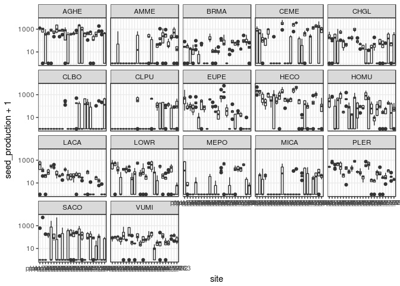

    gg_rawseed_hist <- ggplot(dat) + geom_histogram(aes(seed_production+1))
    gg_rawseed_hist + scale_x_log10() # Note logged X-axis

    ## `stat_bin()` using `bins = 30`. Pick better value with `binwidth`.

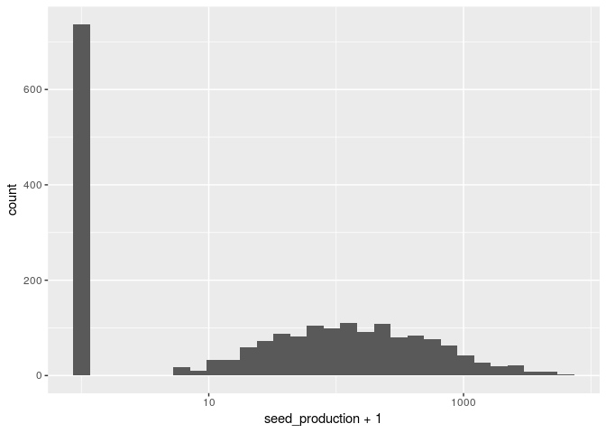

Now we import the environmental data

    site_data <- read_delim("~/Dropbox/spatial_tapioca/data/environmental/all_environmental_data.csv", delim = ",") 

    ## Parsed with column specification:
    ## cols(
    ##   .default = col_double(),
    ##   plot = col_integer(),
    ##   type = col_character(),
    ##   organic_matter_ENR = col_integer(),
    ##   Nitrate_ppm = col_integer(),
    ##   sand = col_integer(),
    ##   clay = col_integer(),
    ##   microsite = col_character()
    ## )

    ## See spec(...) for full column specifications.

    site_data <- site_data %>% rename(site = plot) %>% mutate(site = paste0("plot_", site))
    merged_df <- left_join(dat, site_data)

    ## Joining, by = "site"

    theme_set(theme_bw())
    gg_seed <- ggplot(merged_df, aes(y = seed_production+1)) + facet_wrap(~ species, ncol = 5) + scale_y_log10()
    gg_seed + geom_point(aes(x = depth))

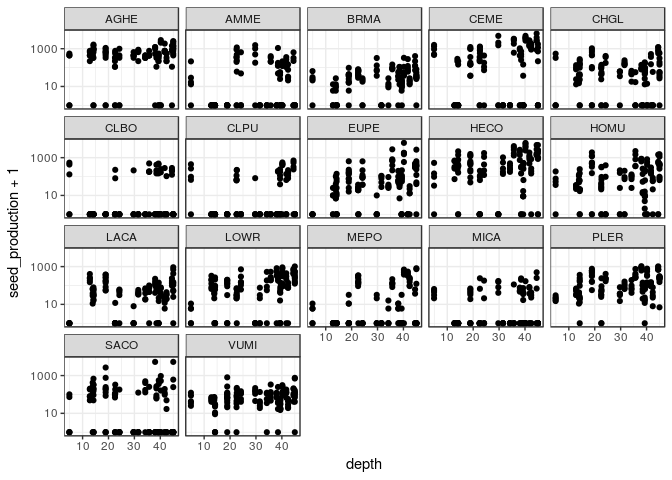

    gg_seed + geom_point(aes(x = Tmax))

    gg_seed + geom_point(aes(x = organic_matter_ENR))

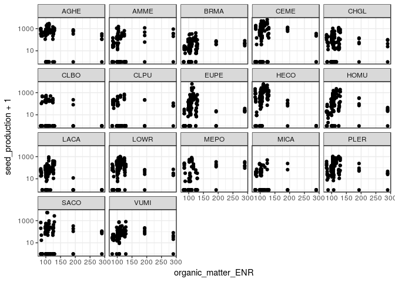

    gg_seed + geom_point(aes(x = pH))

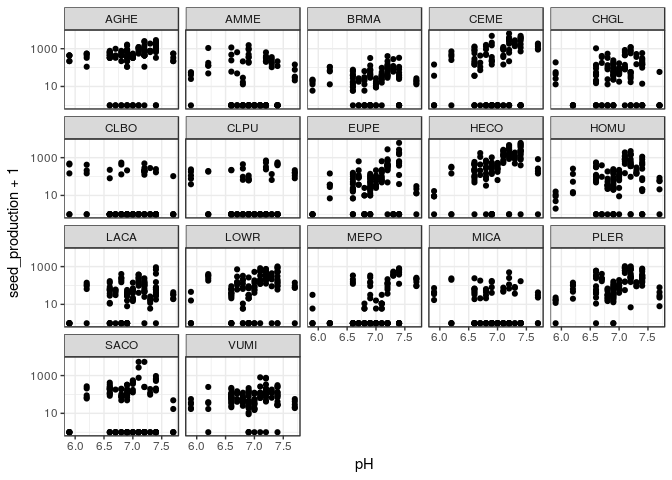

    gg_seed + geom_point(aes(x = CEC_meq_100g))

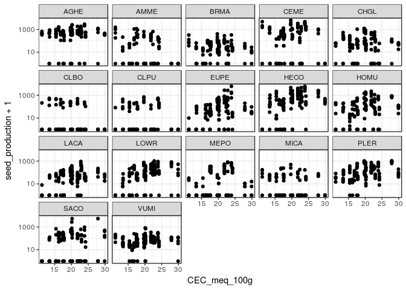

    gg_seed + geom_point(aes(x = soil_moisture))

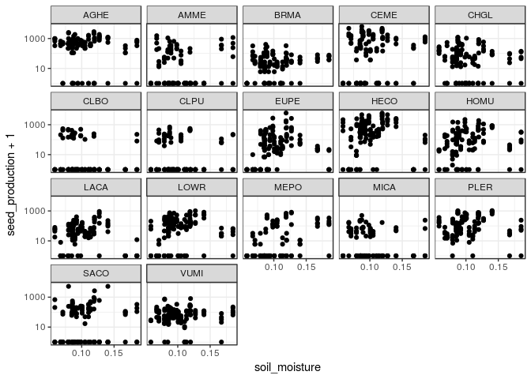

    gg_seed + geom_point(aes(x = Nitrate_ppm))

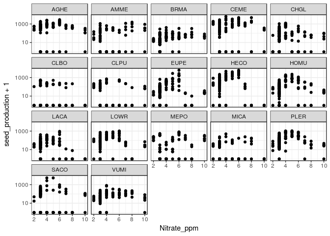

    gg_seed + geom_point(aes(x = Mg_ppm))

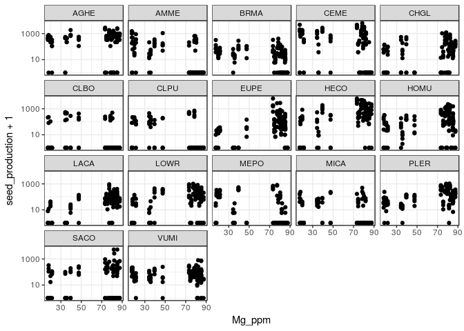

    gg_seed + geom_point(aes(x = Ca_ppm))

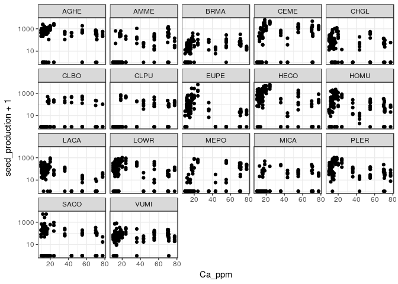

    gg_seed + geom_point(aes(x = sand))

    gg_seed + geom_point(aes(x = NH4_N_ppm))

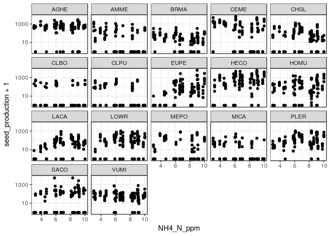

Now we play with some models

    glmer(data = merged_df, formula = seed_production~depth + (1|species), family = poisson(link = log))

    ## Warning in checkConv(attr(opt, "derivs"), opt$par, ctrl = control$checkConv, : Model is nearly unidentifiable: very large eigenvalue
    ##  - Rescale variables?;Model is nearly unidentifiable: large eigenvalue ratio
    ##  - Rescale variables?

    ## Generalized linear mixed model fit by maximum likelihood (Laplace
    ##   Approximation) [glmerMod]
    ##  Family: poisson  ( log )
    ## Formula: seed_production ~ depth + (1 | species)
    ##    Data: merged_df
    ##       AIC       BIC    logLik  deviance  df.resid 
    ##  812329.2  812346.2 -406161.6  812323.2      2080 
    ## Random effects:
    ##  Groups  Name        Std.Dev.
    ##  species (Intercept) 0.9605  
    ## Number of obs: 2083, groups:  species, 17
    ## Fixed Effects:
    ## (Intercept)        depth  
    ##     3.78519      0.03791  
    ## convergence code 0; 2 optimizer warnings; 0 lme4 warnings

    glmer(data = merged_df, formula = seed_production~Tmax + (1|species), family = poisson(link = log))

    ## Warning in checkConv(attr(opt, "derivs"), opt$par, ctrl = control$checkConv, : Model is nearly unidentifiable: very large eigenvalue
    ##  - Rescale variables?

    ## Generalized linear mixed model fit by maximum likelihood (Laplace
    ##   Approximation) [glmerMod]
    ##  Family: poisson  ( log )
    ## Formula: seed_production ~ Tmax + (1 | species)
    ##    Data: merged_df
    ##       AIC       BIC    logLik  deviance  df.resid 
    ##  898648.0  898664.9 -449321.0  898642.0      2080 
    ## Random effects:
    ##  Groups  Name        Std.Dev.
    ##  species (Intercept) 0.9609  
    ## Number of obs: 2083, groups:  species, 17
    ## Fixed Effects:
    ## (Intercept)         Tmax  
    ##     5.43927     -0.01825  
    ## convergence code 0; 1 optimizer warnings; 0 lme4 warnings

    glmer(data = merged_df, formula = seed_production~organic_matter_ENR + (1|species), family = poisson(link = log))

    ## Warning in checkConv(attr(opt, "derivs"), opt$par, ctrl = control$checkConv, : Model failed to converge with max|grad| = 0.00806695 (tol = 0.001, component 1)

    ## Warning in checkConv(attr(opt, "derivs"), opt$par, ctrl = control$checkConv, : Model is nearly unidentifiable: very large eigenvalue
    ##  - Rescale variables?;Model is nearly unidentifiable: large eigenvalue ratio
    ##  - Rescale variables?

    ## Generalized linear mixed model fit by maximum likelihood (Laplace
    ##   Approximation) [glmerMod]
    ##  Family: poisson  ( log )
    ## Formula: seed_production ~ organic_matter_ENR + (1 | species)
    ##    Data: merged_df
    ##       AIC       BIC    logLik  deviance  df.resid 
    ##  897530.7  897547.6 -448762.3  897524.7      2080 
    ## Random effects:
    ##  Groups  Name        Std.Dev.
    ##  species (Intercept) 0.9611  
    ## Number of obs: 2083, groups:  species, 17
    ## Fixed Effects:
    ##        (Intercept)  organic_matter_ENR  
    ##           5.211946           -0.001779  
    ## convergence code 0; 3 optimizer warnings; 0 lme4 warnings

    glmer(data = merged_df, formula = seed_production~pH + (1|species), family = poisson(link = log))

    ## Generalized linear mixed model fit by maximum likelihood (Laplace
    ##   Approximation) [glmerMod]
    ##  Family: poisson  ( log )
    ## Formula: seed_production ~ pH + (1 | species)
    ##    Data: merged_df
    ##       AIC       BIC    logLik  deviance  df.resid 
    ##  794538.1  794555.0 -397266.1  794532.1      2080 
    ## Random effects:
    ##  Groups  Name        Std.Dev.
    ##  species (Intercept) 0.9611  
    ## Number of obs: 2083, groups:  species, 17
    ## Fixed Effects:
    ## (Intercept)           pH  
    ##      -4.122        1.297

    glmer(data = merged_df, formula = seed_production~CEC_meq_100g + (1|species), family = poisson(link = log))

    ## Warning in checkConv(attr(opt, "derivs"), opt$par, ctrl = control$checkConv, : Model is nearly unidentifiable: very large eigenvalue
    ##  - Rescale variables?

    ## Generalized linear mixed model fit by maximum likelihood (Laplace
    ##   Approximation) [glmerMod]
    ##  Family: poisson  ( log )
    ## Formula: seed_production ~ CEC_meq_100g + (1 | species)
    ##    Data: merged_df
    ##       AIC       BIC    logLik  deviance  df.resid 
    ##  859568.5  859585.4 -429781.2  859562.5      2080 
    ## Random effects:
    ##  Groups  Name        Std.Dev.
    ##  species (Intercept) 0.9609  
    ## Number of obs: 2083, groups:  species, 17
    ## Fixed Effects:
    ##  (Intercept)  CEC_meq_100g  
    ##      3.71812       0.06338  
    ## convergence code 0; 1 optimizer warnings; 0 lme4 warnings

    glmer(data = merged_df, formula = seed_production~soil_moisture + (1|species), family = poisson(link = log))

    ## Generalized linear mixed model fit by maximum likelihood (Laplace
    ##   Approximation) [glmerMod]
    ##  Family: poisson  ( log )
    ## Formula: seed_production ~ soil_moisture + (1 | species)
    ##    Data: merged_df
    ##       AIC       BIC    logLik  deviance  df.resid 
    ##  893925.2  893942.2 -446959.6  893919.2      2080 
    ## Random effects:
    ##  Groups  Name        Std.Dev.
    ##  species (Intercept) 0.9609  
    ## Number of obs: 2083, groups:  species, 17
    ## Fixed Effects:
    ##   (Intercept)  soil_moisture  
    ##         4.636          3.569

    glmer(data = merged_df, formula = seed_production~Nitrate_ppm + (1|species), family = poisson(link = log))

    ## Warning in checkConv(attr(opt, "derivs"), opt$par, ctrl = control$checkConv, : Model is nearly unidentifiable: very large eigenvalue
    ##  - Rescale variables?

    ## Generalized linear mixed model fit by maximum likelihood (Laplace
    ##   Approximation) [glmerMod]
    ##  Family: poisson  ( log )
    ## Formula: seed_production ~ Nitrate_ppm + (1 | species)
    ##    Data: merged_df
    ##       AIC       BIC    logLik  deviance  df.resid 
    ##  878842.7  878859.6 -439418.3  878836.7      2080 
    ## Random effects:
    ##  Groups  Name        Std.Dev.
    ##  species (Intercept) 0.9604  
    ## Number of obs: 2083, groups:  species, 17
    ## Fixed Effects:
    ## (Intercept)  Nitrate_ppm  
    ##     4.57877      0.09797  
    ## convergence code 0; 1 optimizer warnings; 0 lme4 warnings

    glmer(data = merged_df, formula = seed_production~Mg_ppm + (1|species), family = poisson(link = log))

    ## Warning in checkConv(attr(opt, "derivs"), opt$par, ctrl = control$checkConv, : Model failed to converge with max|grad| = 0.00109306 (tol = 0.001, component 1)

    ## Warning in checkConv(attr(opt, "derivs"), opt$par, ctrl = control$checkConv, : Model is nearly unidentifiable: very large eigenvalue
    ##  - Rescale variables?;Model is nearly unidentifiable: large eigenvalue ratio
    ##  - Rescale variables?

    ## Generalized linear mixed model fit by maximum likelihood (Laplace
    ##   Approximation) [glmerMod]
    ##  Family: poisson  ( log )
    ## Formula: seed_production ~ Mg_ppm + (1 | species)
    ##    Data: merged_df
    ##       AIC       BIC    logLik  deviance  df.resid 
    ##  882452.2  882469.1 -441223.1  882446.2      2080 
    ## Random effects:
    ##  Groups  Name        Std.Dev.
    ##  species (Intercept) 0.961   
    ## Number of obs: 2083, groups:  species, 17
    ## Fixed Effects:
    ## (Intercept)       Mg_ppm  
    ##    4.484523     0.007863  
    ## convergence code 0; 3 optimizer warnings; 0 lme4 warnings

    glmer(data = merged_df, formula = seed_production~Ca_ppm + (1|species), family = poisson(link = log))

    ## Warning in checkConv(attr(opt, "derivs"), opt$par, ctrl = control$checkConv, : Model is nearly unidentifiable: very large eigenvalue
    ##  - Rescale variables?;Model is nearly unidentifiable: large eigenvalue ratio
    ##  - Rescale variables?

    ## Generalized linear mixed model fit by maximum likelihood (Laplace
    ##   Approximation) [glmerMod]
    ##  Family: poisson  ( log )
    ## Formula: seed_production ~ Ca_ppm + (1 | species)
    ##    Data: merged_df
    ##       AIC       BIC    logLik  deviance  df.resid 
    ##  891675.1  891692.0 -445834.5  891669.1      2080 
    ## Random effects:
    ##  Groups  Name        Std.Dev.
    ##  species (Intercept) 0.961   
    ## Number of obs: 2083, groups:  species, 17
    ## Fixed Effects:
    ## (Intercept)       Ca_ppm  
    ##    5.171097    -0.005886  
    ## convergence code 0; 2 optimizer warnings; 0 lme4 warnings

    glmer(data = merged_df, formula = seed_production~sand + (1|species), family = poisson(link = log))

    ## Warning in checkConv(attr(opt, "derivs"), opt$par, ctrl = control$checkConv, : Model is nearly unidentifiable: very large eigenvalue
    ##  - Rescale variables?;Model is nearly unidentifiable: large eigenvalue ratio
    ##  - Rescale variables?

    ## Generalized linear mixed model fit by maximum likelihood (Laplace
    ##   Approximation) [glmerMod]
    ##  Family: poisson  ( log )
    ## Formula: seed_production ~ sand + (1 | species)
    ##    Data: merged_df
    ##       AIC       BIC    logLik  deviance  df.resid 
    ##  853452.4  853469.4 -426723.2  853446.4      2080 
    ## Random effects:
    ##  Groups  Name        Std.Dev.
    ##  species (Intercept) 0.9607  
    ## Number of obs: 2083, groups:  species, 17
    ## Fixed Effects:
    ## (Intercept)         sand  
    ##     6.08023     -0.02505  
    ## convergence code 0; 2 optimizer warnings; 0 lme4 warnings

    glmer(data = merged_df, formula = seed_production~NH4_N_ppm + (1|species), family = poisson(link = log))

    ## Warning in checkConv(attr(opt, "derivs"), opt$par, ctrl = control$checkConv, : Model is nearly unidentifiable: very large eigenvalue
    ##  - Rescale variables?

    ## Generalized linear mixed model fit by maximum likelihood (Laplace
    ##   Approximation) [glmerMod]
    ##  Family: poisson  ( log )
    ## Formula: seed_production ~ NH4_N_ppm + (1 | species)
    ##    Data: merged_df
    ##       AIC       BIC    logLik  deviance  df.resid 
    ##  896513.2  896530.1 -448253.6  896507.2      2080 
    ## Random effects:
    ##  Groups  Name        Std.Dev.
    ##  species (Intercept) 0.961   
    ## Number of obs: 2083, groups:  species, 17
    ## Fixed Effects:
    ## (Intercept)    NH4_N_ppm  
    ##     4.71466      0.04099  
    ## convergence code 0; 1 optimizer warnings; 0 lme4 warnings
