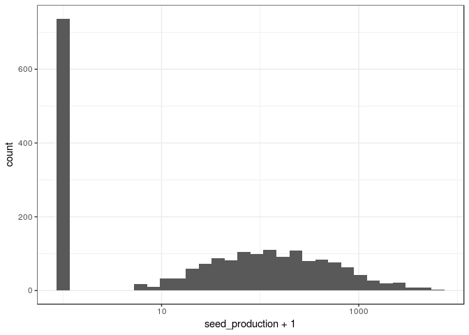

Here I begin to recreate the dummy analyses presented in [this
document](dummy-dataset-analysis.md)

    library(tidyverse); theme_set(theme_bw())

    ## ── Attaching packages ────────────────────────────────────────────────────────────── tidyverse 1.2.1 ──

    ## ✔ ggplot2 2.2.1     ✔ purrr   0.2.4
    ## ✔ tibble  1.4.2     ✔ dplyr   0.7.4
    ## ✔ tidyr   0.8.0     ✔ stringr 1.2.0
    ## ✔ readr   1.1.1     ✔ forcats 0.2.0

    ## ── Conflicts ───────────────────────────────────────────────────────────────── tidyverse_conflicts() ──
    ## ✖ dplyr::filter() masks stats::filter()
    ## ✖ dplyr::lag()    masks stats::lag()

    library(lme4)

    ## Loading required package: Matrix

    ## 
    ## Attaching package: 'Matrix'

    ## The following object is masked from 'package:tidyr':
    ## 
    ##     expand

    library(vegan)

    ## Loading required package: permute

    ## Loading required package: lattice

    ## This is vegan 2.4-6

    library(glmmTMB)
    library(bbmle)

    ## Loading required package: stats4

    ## 
    ## Attaching package: 'bbmle'

    ## The following object is masked from 'package:dplyr':
    ## 
    ##     slice

Let's import in the performance data and clean it up to our needs.

    if(thinkpad){
      dat <- read_delim("../data/performance/seed_production_processed.csv", 
                      col_names = T, delim = ",")
    } else {
      dat <- read_delim("~/Dropbox/spatial_tapioca/data/performance/seed_production_processed.csv", 
                        col_names = T, delim = ",")
    }

    ## Parsed with column specification:
    ## cols(
    ##   plot_num = col_integer(),
    ##   plot_type = col_character(),
    ##   replicate = col_integer(),
    ##   sp_code = col_character(),
    ##   num_seeds_produced = col_integer()
    ## )

    ## Warning in rbind(names(probs), probs_f): number of columns of result is not
    ## a multiple of vector length (arg 1)

    ## Warning: 21 parsing failures.
    ## row # A tibble: 5 x 5 col     row col                expected               actual file              expected   <int> <chr>              <chr>                  <chr>  <chr>             actual 1  1157 num_seeds_produced no trailing characters .6664  '../data/perform… file 2  1195 num_seeds_produced no trailing characters .9858  '../data/perform… row 3  1197 num_seeds_produced no trailing characters .5     '../data/perform… col 4  1206 num_seeds_produced no trailing characters .25    '../data/perform… expected 5  1208 num_seeds_produced no trailing characters .22    '../data/perform…
    ## ... ................. ... .......................................................................... ........ .......................................................................... ...... .......................................................................... .... .......................................................................... ... .......................................................................... ... .......................................................................... ........ ..........................................................................
    ## See problems(...) for more details.

    dat <- dat %>% filter(plot_type == "L") %>% 
      mutate(plot_num = paste0("plot_", plot_num),
                   replicate = as.factor(replicate),
                   num_seeds_produced = ifelse(is.na(num_seeds_produced), 0, num_seeds_produced)) %>%
      rename(species = sp_code, seed_production = num_seeds_produced, site = plot_num) %>% select(-plot_type)

    dat

    ## # A tibble: 2,083 x 4
    ##    site     replicate species seed_production
    ##    <chr>    <fct>     <chr>             <dbl>
    ##  1 plot_740 1         AGHE                768
    ##  2 plot_740 2         AGHE               1206
    ##  3 plot_740 3         AGHE               1425
    ##  4 plot_740 4         AGHE               1864
    ##  5 plot_740 5         AGHE               1425
    ##  6 plot_740 6         AGHE                987
    ##  7 plot_741 1         AGHE               1206
    ##  8 plot_741 2         AGHE                987
    ##  9 plot_741 3         AGHE                548
    ## 10 plot_741 4         AGHE               1206
    ## # ... with 2,073 more rows

    gg_raw_seed <- ggplot(dat) + geom_boxplot(aes(site,seed_production+1)) + 
      facet_wrap(~species, ncol = 5) + scale_y_log10()
    gg_raw_seed

    gg_rawseed_hist <- ggplot(dat) + geom_histogram(aes(seed_production+1))
    gg_rawseed_hist + scale_x_log10() # Note logged X-axis

    ## `stat_bin()` using `bins = 30`. Pick better value with `binwidth`.

Now we import the environmental data

    if(thinkpad){
      env_dat <- read_delim("../data/environmental/all_environmental_data.csv", delim = ",")
    } else {
      env_dat <- read_delim("~/Dropbox/spatial_tapioca/data/environmental/all_environmental_data.csv",
                            delim = ",") 
    }

    ## Parsed with column specification:
    ## cols(
    ##   .default = col_double(),
    ##   plot = col_integer(),
    ##   type = col_character(),
    ##   organic_matter_ENR = col_integer(),
    ##   Nitrate_ppm = col_integer(),
    ##   sand = col_integer(),
    ##   clay = col_integer(),
    ##   microsite = col_character()
    ## )

    ## See spec(...) for full column specifications.

    env_dat <- env_dat %>% rename(site = plot) %>% mutate(site = paste0("plot_", site))
    # skimr::skim(env_dat) %>% select(-missing, -complete, -n)

    plot(env_dat %>% select(-site, -lat, -lon, -type, - microsite, -ele), 
         pch = 21, bg = alpha("black", .25))

Before going too far into the models, let's do an NMDS- there's a lot of
soil variables to consider, so it might be wise to reduce dimensionality
if there are colinear columns.

    # Subset the dataset to filter out some of the columns that are factors, or are repetitive...
    env_dat_c <- env_dat %>% select(-type, -microsite, -lat, -lon, -Tmin, -ele) %>% 
      as.data.frame %>% tibble::column_to_rownames("site") 
    soilmds <- metaMDS(env_dat_c)

    ## Square root transformation
    ## Wisconsin double standardization
    ## Run 0 stress 0.09565685 
    ## Run 1 stress 0.09983745 
    ## Run 2 stress 0.1528405 
    ## Run 3 stress 0.1063597 
    ## Run 4 stress 0.09983743 
    ## Run 5 stress 0.09565687 
    ## ... Procrustes: rmse 4.203246e-05  max resid 8.158366e-05 
    ## ... Similar to previous best
    ## Run 6 stress 0.1063597 
    ## Run 7 stress 0.1063597 
    ## Run 8 stress 0.09983736 
    ## Run 9 stress 0.09565685 
    ## ... Procrustes: rmse 1.046536e-05  max resid 2.464361e-05 
    ## ... Similar to previous best
    ## Run 10 stress 0.09565685 
    ## ... New best solution
    ## ... Procrustes: rmse 6.185339e-06  max resid 1.216053e-05 
    ## ... Similar to previous best
    ## Run 11 stress 0.09565685 
    ## ... Procrustes: rmse 5.818232e-06  max resid 1.13022e-05 
    ## ... Similar to previous best
    ## Run 12 stress 0.1063597 
    ## Run 13 stress 0.1063597 
    ## Run 14 stress 0.1374202 
    ## Run 15 stress 0.1063597 
    ## Run 16 stress 0.09565685 
    ## ... Procrustes: rmse 2.397106e-05  max resid 4.760987e-05 
    ## ... Similar to previous best
    ## Run 17 stress 0.0998374 
    ## Run 18 stress 0.1572407 
    ## Run 19 stress 0.1057252 
    ## Run 20 stress 0.09565685 
    ## ... Procrustes: rmse 1.259869e-05  max resid 2.432769e-05 
    ## ... Similar to previous best
    ## *** Solution reached

    plot(soilmds)
    orditorp(soilmds, display="species", cex = 1.2)

    plot(soilmds)
    orditorp(soilmds, display="sites")

    # Merge in the MDS scores into the env_dat dataframe
    env_dat <- left_join(env_dat, soilmds$points %>% as.data.frame %>% tibble::rownames_to_column("site"))

    ## Joining, by = "site"

    # Take a look at what the distribution looks like. 
    # skimr::skim(env_dat %>% select(MDS1, MDS2))
    # Merge in the environmental data with the performance-by-site data, for easier modeling later. 
    merged_df <- left_join(dat, env_dat)

    ## Joining, by = "site"

Let's do some exploratory plotting of seed production vs. environmental
factors

    gg_seed <- ggplot(merged_df, aes(y = seed_production+1)) + 
      facet_wrap(~ species, ncol = 5) + scale_y_log10()

    gg_seed + geom_point(aes(x = depth))

    gg_seed + geom_point(aes(x = Tmax))

    gg_seed + geom_point(aes(x = organic_matter_ENR))

    gg_seed + geom_point(aes(x = pH))

    gg_seed + geom_point(aes(x = CEC_meq_100g))

    gg_seed + geom_point(aes(x = soil_moisture))

    gg_seed + geom_point(aes(x = Nitrate_ppm))

    gg_seed + geom_point(aes(x = Mg_ppm))

    gg_seed + geom_point(aes(x = Ca_ppm))

    gg_seed + geom_point(aes(x = sand))

    gg_seed + geom_point(aes(x = NH4_N_ppm))

    gg_seed + geom_point(aes(x = MDS1))

    gg_seed + geom_point(aes(x = MDS2))

And let's do a first pass on modeling seed production as a function of
each environmental variable independently.

    glmer(data = merged_df, formula = seed_production~depth + (1|species), family = poisson(link = log))

    ## Warning in checkConv(attr(opt, "derivs"), opt$par, ctrl = control$checkConv, : Model is nearly unidentifiable: very large eigenvalue
    ##  - Rescale variables?;Model is nearly unidentifiable: large eigenvalue ratio
    ##  - Rescale variables?

    ## Generalized linear mixed model fit by maximum likelihood (Laplace
    ##   Approximation) [glmerMod]
    ##  Family: poisson  ( log )
    ## Formula: seed_production ~ depth + (1 | species)
    ##    Data: merged_df
    ##       AIC       BIC    logLik  deviance  df.resid 
    ##  812329.2  812346.2 -406161.6  812323.2      2080 
    ## Random effects:
    ##  Groups  Name        Std.Dev.
    ##  species (Intercept) 0.9605  
    ## Number of obs: 2083, groups:  species, 17
    ## Fixed Effects:
    ## (Intercept)        depth  
    ##     3.78519      0.03791  
    ## convergence code 0; 2 optimizer warnings; 0 lme4 warnings

    glmer(data = merged_df, formula = seed_production~Tmax + (1|species), family = poisson(link = log))

    ## Warning in checkConv(attr(opt, "derivs"), opt$par, ctrl = control$checkConv, : Model is nearly unidentifiable: very large eigenvalue
    ##  - Rescale variables?

    ## Generalized linear mixed model fit by maximum likelihood (Laplace
    ##   Approximation) [glmerMod]
    ##  Family: poisson  ( log )
    ## Formula: seed_production ~ Tmax + (1 | species)
    ##    Data: merged_df
    ##       AIC       BIC    logLik  deviance  df.resid 
    ##  898648.0  898664.9 -449321.0  898642.0      2080 
    ## Random effects:
    ##  Groups  Name        Std.Dev.
    ##  species (Intercept) 0.9609  
    ## Number of obs: 2083, groups:  species, 17
    ## Fixed Effects:
    ## (Intercept)         Tmax  
    ##     5.43927     -0.01825  
    ## convergence code 0; 1 optimizer warnings; 0 lme4 warnings

    glmer(data = merged_df, formula = seed_production~organic_matter_ENR + (1|species), family = poisson(link = log))

    ## Warning in checkConv(attr(opt, "derivs"), opt$par, ctrl = control$checkConv, : Model failed to converge with max|grad| = 0.00806695 (tol = 0.001, component 1)

    ## Warning in checkConv(attr(opt, "derivs"), opt$par, ctrl = control$checkConv, : Model is nearly unidentifiable: very large eigenvalue
    ##  - Rescale variables?;Model is nearly unidentifiable: large eigenvalue ratio
    ##  - Rescale variables?

    ## Generalized linear mixed model fit by maximum likelihood (Laplace
    ##   Approximation) [glmerMod]
    ##  Family: poisson  ( log )
    ## Formula: seed_production ~ organic_matter_ENR + (1 | species)
    ##    Data: merged_df
    ##       AIC       BIC    logLik  deviance  df.resid 
    ##  897530.7  897547.6 -448762.3  897524.7      2080 
    ## Random effects:
    ##  Groups  Name        Std.Dev.
    ##  species (Intercept) 0.9611  
    ## Number of obs: 2083, groups:  species, 17
    ## Fixed Effects:
    ##        (Intercept)  organic_matter_ENR  
    ##           5.211946           -0.001779  
    ## convergence code 0; 3 optimizer warnings; 0 lme4 warnings

    glmer(data = merged_df, formula = seed_production~pH + (1|species), family = poisson(link = log))

    ## Generalized linear mixed model fit by maximum likelihood (Laplace
    ##   Approximation) [glmerMod]
    ##  Family: poisson  ( log )
    ## Formula: seed_production ~ pH + (1 | species)
    ##    Data: merged_df
    ##       AIC       BIC    logLik  deviance  df.resid 
    ##  794538.1  794555.0 -397266.1  794532.1      2080 
    ## Random effects:
    ##  Groups  Name        Std.Dev.
    ##  species (Intercept) 0.9611  
    ## Number of obs: 2083, groups:  species, 17
    ## Fixed Effects:
    ## (Intercept)           pH  
    ##      -4.122        1.297

    glmer(data = merged_df, formula = seed_production~CEC_meq_100g + (1|species), family = poisson(link = log))

    ## Warning in checkConv(attr(opt, "derivs"), opt$par, ctrl = control$checkConv, : Model is nearly unidentifiable: very large eigenvalue
    ##  - Rescale variables?

    ## Generalized linear mixed model fit by maximum likelihood (Laplace
    ##   Approximation) [glmerMod]
    ##  Family: poisson  ( log )
    ## Formula: seed_production ~ CEC_meq_100g + (1 | species)
    ##    Data: merged_df
    ##       AIC       BIC    logLik  deviance  df.resid 
    ##  859568.5  859585.4 -429781.2  859562.5      2080 
    ## Random effects:
    ##  Groups  Name        Std.Dev.
    ##  species (Intercept) 0.9609  
    ## Number of obs: 2083, groups:  species, 17
    ## Fixed Effects:
    ##  (Intercept)  CEC_meq_100g  
    ##      3.71812       0.06338  
    ## convergence code 0; 1 optimizer warnings; 0 lme4 warnings

    glmer(data = merged_df, formula = seed_production~soil_moisture + (1|species), family = poisson(link = log))

    ## Generalized linear mixed model fit by maximum likelihood (Laplace
    ##   Approximation) [glmerMod]
    ##  Family: poisson  ( log )
    ## Formula: seed_production ~ soil_moisture + (1 | species)
    ##    Data: merged_df
    ##       AIC       BIC    logLik  deviance  df.resid 
    ##  893925.2  893942.2 -446959.6  893919.2      2080 
    ## Random effects:
    ##  Groups  Name        Std.Dev.
    ##  species (Intercept) 0.9609  
    ## Number of obs: 2083, groups:  species, 17
    ## Fixed Effects:
    ##   (Intercept)  soil_moisture  
    ##         4.636          3.569

    glmer(data = merged_df, formula = seed_production~Nitrate_ppm + (1|species), family = poisson(link = log))

    ## Warning in checkConv(attr(opt, "derivs"), opt$par, ctrl = control$checkConv, : Model is nearly unidentifiable: very large eigenvalue
    ##  - Rescale variables?

    ## Generalized linear mixed model fit by maximum likelihood (Laplace
    ##   Approximation) [glmerMod]
    ##  Family: poisson  ( log )
    ## Formula: seed_production ~ Nitrate_ppm + (1 | species)
    ##    Data: merged_df
    ##       AIC       BIC    logLik  deviance  df.resid 
    ##  878842.7  878859.6 -439418.3  878836.7      2080 
    ## Random effects:
    ##  Groups  Name        Std.Dev.
    ##  species (Intercept) 0.9604  
    ## Number of obs: 2083, groups:  species, 17
    ## Fixed Effects:
    ## (Intercept)  Nitrate_ppm  
    ##     4.57877      0.09797  
    ## convergence code 0; 1 optimizer warnings; 0 lme4 warnings

    glmer(data = merged_df, formula = seed_production~Mg_ppm + (1|species), family = poisson(link = log))

    ## Warning in checkConv(attr(opt, "derivs"), opt$par, ctrl = control$checkConv, : Model failed to converge with max|grad| = 0.00109306 (tol = 0.001, component 1)

    ## Warning in checkConv(attr(opt, "derivs"), opt$par, ctrl = control$checkConv, : Model is nearly unidentifiable: very large eigenvalue
    ##  - Rescale variables?;Model is nearly unidentifiable: large eigenvalue ratio
    ##  - Rescale variables?

    ## Generalized linear mixed model fit by maximum likelihood (Laplace
    ##   Approximation) [glmerMod]
    ##  Family: poisson  ( log )
    ## Formula: seed_production ~ Mg_ppm + (1 | species)
    ##    Data: merged_df
    ##       AIC       BIC    logLik  deviance  df.resid 
    ##  882452.2  882469.1 -441223.1  882446.2      2080 
    ## Random effects:
    ##  Groups  Name        Std.Dev.
    ##  species (Intercept) 0.961   
    ## Number of obs: 2083, groups:  species, 17
    ## Fixed Effects:
    ## (Intercept)       Mg_ppm  
    ##    4.484523     0.007863  
    ## convergence code 0; 3 optimizer warnings; 0 lme4 warnings

    glmer(data = merged_df, formula = seed_production~Ca_ppm + (1|species), family = poisson(link = log))

    ## Warning in checkConv(attr(opt, "derivs"), opt$par, ctrl = control$checkConv, : Model is nearly unidentifiable: very large eigenvalue
    ##  - Rescale variables?;Model is nearly unidentifiable: large eigenvalue ratio
    ##  - Rescale variables?

    ## Generalized linear mixed model fit by maximum likelihood (Laplace
    ##   Approximation) [glmerMod]
    ##  Family: poisson  ( log )
    ## Formula: seed_production ~ Ca_ppm + (1 | species)
    ##    Data: merged_df
    ##       AIC       BIC    logLik  deviance  df.resid 
    ##  891675.1  891692.0 -445834.5  891669.1      2080 
    ## Random effects:
    ##  Groups  Name        Std.Dev.
    ##  species (Intercept) 0.961   
    ## Number of obs: 2083, groups:  species, 17
    ## Fixed Effects:
    ## (Intercept)       Ca_ppm  
    ##    5.171097    -0.005886  
    ## convergence code 0; 2 optimizer warnings; 0 lme4 warnings

    glmer(data = merged_df, formula = seed_production~sand + (1|species), family = poisson(link = log))

    ## Warning in checkConv(attr(opt, "derivs"), opt$par, ctrl = control$checkConv, : Model is nearly unidentifiable: very large eigenvalue
    ##  - Rescale variables?;Model is nearly unidentifiable: large eigenvalue ratio
    ##  - Rescale variables?

    ## Generalized linear mixed model fit by maximum likelihood (Laplace
    ##   Approximation) [glmerMod]
    ##  Family: poisson  ( log )
    ## Formula: seed_production ~ sand + (1 | species)
    ##    Data: merged_df
    ##       AIC       BIC    logLik  deviance  df.resid 
    ##  853452.4  853469.4 -426723.2  853446.4      2080 
    ## Random effects:
    ##  Groups  Name        Std.Dev.
    ##  species (Intercept) 0.9607  
    ## Number of obs: 2083, groups:  species, 17
    ## Fixed Effects:
    ## (Intercept)         sand  
    ##     6.08023     -0.02505  
    ## convergence code 0; 2 optimizer warnings; 0 lme4 warnings

    glmer(data = merged_df, formula = seed_production~NH4_N_ppm + (1|species), family = poisson(link = log))

    ## Warning in checkConv(attr(opt, "derivs"), opt$par, ctrl = control$checkConv, : Model is nearly unidentifiable: very large eigenvalue
    ##  - Rescale variables?

    ## Generalized linear mixed model fit by maximum likelihood (Laplace
    ##   Approximation) [glmerMod]
    ##  Family: poisson  ( log )
    ## Formula: seed_production ~ NH4_N_ppm + (1 | species)
    ##    Data: merged_df
    ##       AIC       BIC    logLik  deviance  df.resid 
    ##  896513.2  896530.1 -448253.6  896507.2      2080 
    ## Random effects:
    ##  Groups  Name        Std.Dev.
    ##  species (Intercept) 0.961   
    ## Number of obs: 2083, groups:  species, 17
    ## Fixed Effects:
    ## (Intercept)    NH4_N_ppm  
    ##     4.71466      0.04099  
    ## convergence code 0; 1 optimizer warnings; 0 lme4 warnings

    a <- glmer(data = merged_df, formula = seed_production~MDS1 + (seed_production|species), family = poisson(link = log))

    ## Warning in checkConv(attr(opt, "derivs"), opt$par, ctrl = control$checkConv, : Model failed to converge with max|grad| = 0.0531428 (tol = 0.001, component 1)

    ## Warning in checkConv(attr(opt, "derivs"), opt$par, ctrl = control$checkConv, : Model is nearly unidentifiable: very large eigenvalue
    ##  - Rescale variables?;Model is nearly unidentifiable: large eigenvalue ratio
    ##  - Rescale variables?

    b <- glmer(data = merged_df, formula = seed_production~MDS2 + (1|species), family = poisson(link = log))

An alternative (and I'm not sure at this stage which is the better
approach to this problem) is to do a complete model.

    glmer(data = merged_df, formula = seed_production~depth+Tmax+organic_matter_ENR+pH+CEC_meq_100g+soil_moisture+
            Nitrate_ppm + Mg_ppm + Ca_ppm + sand + NH4_N_ppm + MDS1 + MDS2 + (1|site), family = poisson)

    ## Warning: Some predictor variables are on very different scales: consider
    ## rescaling

    ## Warning in checkConv(attr(opt, "derivs"), opt$par, ctrl = control
    ## $checkConv, : unable to evaluate scaled gradient

    ## Warning in checkConv(attr(opt, "derivs"), opt$par, ctrl = control
    ## $checkConv, : Model failed to converge: degenerate Hessian with 1 negative
    ## eigenvalues

    ## Generalized linear mixed model fit by maximum likelihood (Laplace
    ##   Approximation) [glmerMod]
    ##  Family: poisson  ( log )
    ## Formula: 
    ## seed_production ~ depth + Tmax + organic_matter_ENR + pH + CEC_meq_100g +  
    ##     soil_moisture + Nitrate_ppm + Mg_ppm + Ca_ppm + sand + NH4_N_ppm +  
    ##     MDS1 + MDS2 + (1 | site)
    ##    Data: merged_df
    ##       AIC       BIC    logLik  deviance  df.resid 
    ## 1053200.4 1053285.0 -526585.2 1053170.4      2068 
    ## Random effects:
    ##  Groups Name        Std.Dev.
    ##  site   (Intercept) 0.3748  
    ## Number of obs: 2083, groups:  site, 24
    ## Fixed Effects:
    ##        (Intercept)               depth                Tmax  
    ##          5.1308571           0.0278382          -0.0708226  
    ## organic_matter_ENR                  pH        CEC_meq_100g  
    ##         -0.0006091           3.4642139           0.0127373  
    ##      soil_moisture         Nitrate_ppm              Mg_ppm  
    ##          3.5341807           0.0651155          -0.2250359  
    ##             Ca_ppm                sand           NH4_N_ppm  
    ##         -0.2543531          -0.0332820          -0.0828522  
    ##               MDS1                MDS2  
    ##          1.2624430           7.8958594  
    ## fit warnings:
    ## Some predictor variables are on very different scales: consider rescaling
    ## convergence code 0; 2 optimizer warnings; 0 lme4 warnings

I think I need to take a step back.
===================================

There's a ton of complexity in these models and I'm getting a little
overwhelmed by the number of options. So I want to take a step back and
break down what I am trying to do here.

The core question for this portion of the analysis is **whether seed
production responds to site-variation, and whether species differ in
their responses**. Let's break things down and focus on this question,
without worrying about environmental variation for now.

I will go back to the data frame `dat`, which has the following
structure:

    dat %>% head

    ## # A tibble: 6 x 4
    ##   site     replicate species seed_production
    ##   <chr>    <fct>     <chr>             <dbl>
    ## 1 plot_740 1         AGHE                768
    ## 2 plot_740 2         AGHE               1206
    ## 3 plot_740 3         AGHE               1425
    ## 4 plot_740 4         AGHE               1864
    ## 5 plot_740 5         AGHE               1425
    ## 6 plot_740 6         AGHE                987

Remember from above that `seed_production` is count data and, based on
the histogram, seems to have a zero-inflation problem. I will use the
modeling functionality in the package **`glmmTMB`** to tackle this
dataset.

    # First, a poisson model with species and plot as fixed effect, replicate as random effect  

    # The zero-eth model just has a species effect and no site effect
    pm0 = glmmTMB(seed_production~species + (1|replicate), dat, family=poisson)
    pm1 = glmmTMB(seed_production~species + site + (1|replicate), dat, family=poisson)

    ## Warning in fitTMB(TMBStruc): Model convergence problem; iteration limit
    ## reached without convergence (10). See vignette('troubleshooting')

    pm2 = glmmTMB(seed_production~species * site + (1|replicate), dat, family=poisson)

    ## Warning in fitTMB(TMBStruc): Model convergence problem; non-positive-
    ## definite Hessian matrix. See vignette('troubleshooting')

    ## Warning in fitTMB(TMBStruc): Model convergence problem; iteration limit
    ## reached without convergence (10). See vignette('troubleshooting')

    nb0 = glmmTMB(seed_production~species + (1|replicate), dat, family=nbinom2)
    nb1 = glmmTMB(seed_production~species + site + (1|replicate), dat, family=nbinom2)
    nb2 = glmmTMB(seed_production~species * site + (1|replicate), dat, family=nbinom2)

    ## Warning in fitTMB(TMBStruc): Model convergence problem; extreme or very
    ## small eigen values detected. See vignette('troubleshooting')

    ## Warning in fitTMB(TMBStruc): Model convergence problem; singular
    ## convergence (7). See vignette('troubleshooting')

    zipm0 = glmmTMB(seed_production~species +(1|replicate), zi=~species, dat, family=poisson)
    zipm0nb = glmmTMB(seed_production~species +(1|replicate), zi=~species, dat, family=nbinom2)
    zipm1nb = glmmTMB(seed_production~species + site +(1|replicate), zi=~species, dat, family=nbinom2)
    zipm2nb = glmmTMB(seed_production~species + site +(1|replicate), zi=~species + site, dat, family=nbinom2)
    zipm3nb = glmmTMB(seed_production~species * site +(1|replicate), zi=~species + site, dat, family=nbinom2)

    ## Warning in nlminb(start = par, objective = fn, gradient = gr, control =
    ## control$optCtrl): NA/NaN function evaluation

    ## Warning in fitTMB(TMBStruc): Model convergence problem; non-positive-
    ## definite Hessian matrix. See vignette('troubleshooting')

    ## Warning in fitTMB(TMBStruc): Model convergence problem; iteration limit
    ## reached without convergence (10). See vignette('troubleshooting')

    zipm4nb = glmmTMB(seed_production~species * site +(1|replicate), zi=~species * site, dat, family=nbinom2)

    ## Warning in fitTMB(TMBStruc): Model convergence problem; non-positive-
    ## definite Hessian matrix. See vignette('troubleshooting')

    ## Warning in fitTMB(TMBStruc): Model convergence problem; iteration limit
    ## reached without convergence (10). See vignette('troubleshooting')

    aic_table <- bbmle::AICtab(pm0, pm1, pm2, 
                  nb0,nb1,nb2,
                  zipm0, 
                  zipm0nb, zipm1nb,zipm2nb, zipm3nb, zipm4nb)
    aic_table

    ##         dAIC     df 
    ## zipm2nb      0.0 82 
    ## zipm1nb     74.8 59 
    ## nb2        447.1 410
    ## zipm0nb    674.4 36 
    ## nb1       1703.2 42 
    ## nb0       1904.5 19 
    ## zipm0   529172.6 35 
    ## pm1     576147.9 41 
    ## pm0     871068.5 18 
    ## pm2           NA 409
    ## zipm3nb       NA 450
    ## zipm4nb       NA 818

According to the AIC table above it looks like the model zipm2nb has the
lowest AIC and therefore the most support in this framework. A good
thing to check at this point is whether the same result holds if we
*scale* the performance data (so that the per-species mean is 0 and the
per-species SD = 1)

    # Scale by species
    # Define a custom function to scale
    scale_this <- function(x) as.vector(scale(x))

    dat_scaled <- dat %>% tidyr::spread(species, seed_production) %>% 
      mutate_if(is.numeric, scale_this) %>% 
      unite(id, c("site", "replicate"), sep = "XX") %>%
      tidyr::gather("species", "seed_production",2:18) %>% 
      separate(id, c("site", "replicate"), sep = "XX")

    dat_scaled

    ## # A tibble: 2,482 x 4
    ##    site     replicate species seed_production
    ##    <chr>    <chr>     <chr>             <dbl>
    ##  1 plot_740 1         AGHE              0.278
    ##  2 plot_740 2         AGHE              1.07 
    ##  3 plot_740 3         AGHE              1.47 
    ##  4 plot_740 4         AGHE              2.27 
    ##  5 plot_740 5         AGHE              1.47 
    ##  6 plot_740 6         AGHE              0.675
    ##  7 plot_741 1         AGHE              1.07 
    ##  8 plot_741 2         AGHE              0.675
    ##  9 plot_741 3         AGHE             -0.121
    ## 10 plot_741 4         AGHE              1.07 
    ## # ... with 2,472 more rows

    pm0_s = glmmTMB(seed_production~species + (1|replicate), dat_scaled)
    pm1_s = glmmTMB(seed_production~species + site + (1|replicate), dat_scaled)
    pm2_s = glmmTMB(seed_production~species * site + (1|replicate), dat_scaled)
    nb0_s = glmmTMB(seed_production~species + (1|replicate), dat_scaled)
    nb1_s = glmmTMB(seed_production~species + site + (1|replicate), dat_scaled)
    nb2_s = glmmTMB(seed_production~species * site + (1|replicate), dat_scaled)
    zipm0_s = glmmTMB(seed_production~species +(1|replicate), zi=~species, dat_scaled)
    zipm1_s = glmmTMB(seed_production~species + site +(1|replicate), zi=~species, dat_scaled)
    zipm2_s = glmmTMB(seed_production~species + site +(1|replicate), zi=~species + site, dat_scaled)

    aic_table2 <- bbmle::AICtab(pm0_s, pm1_s, pm2_s, 
                  nb0_s,nb1_s,nb2_s,
                  zipm0_s, zipm1_s, zipm2_s)
    aic_table2

    ##         dAIC  df 
    ## pm2_s     0.0 410
    ## nb2_s     0.0 410
    ## pm1_s   478.9 42 
    ## nb1_s   478.9 42 
    ## zipm1_s 512.9 59 
    ## zipm2_s 558.9 82 
    ## pm0_s   876.1 19 
    ## nb0_s   876.1 19 
    ## zipm0_s 910.1 36

And for measure, let's also consider seed production as a *proportion*,
i.e. where the seed performance for a species is equal to 1 at it's
maximum seed performance

    # Scale by species
    # Define a custom function to scale
    prop_this <- function(x) as.vector(x/(max(x, na.rm = T)))

    dat_prop <- dat %>% tidyr::spread(species, seed_production) %>% 
      mutate_if(is.numeric, prop_this) %>% 
      unite(id, c("site", "replicate"), sep = "XX") %>%
      tidyr::gather("species", "seed_production",2:18) %>% 
      separate(id, c("site", "replicate"), sep = "XX")

    dat_prop

    ## # A tibble: 2,482 x 4
    ##    site     replicate species seed_production
    ##    <chr>    <chr>     <chr>             <dbl>
    ##  1 plot_740 1         AGHE              0.269
    ##  2 plot_740 2         AGHE              0.423
    ##  3 plot_740 3         AGHE              0.500
    ##  4 plot_740 4         AGHE              0.654
    ##  5 plot_740 5         AGHE              0.500
    ##  6 plot_740 6         AGHE              0.346
    ##  7 plot_741 1         AGHE              0.423
    ##  8 plot_741 2         AGHE              0.346
    ##  9 plot_741 3         AGHE              0.192
    ## 10 plot_741 4         AGHE              0.423
    ## # ... with 2,472 more rows

    pm0_p = glmmTMB(seed_production~species + (1|replicate), dat, family=poisson)
    pm1_p = glmmTMB(seed_production~species + site + (1|replicate), dat, family=poisson)

    ## Warning in fitTMB(TMBStruc): Model convergence problem; iteration limit
    ## reached without convergence (10). See vignette('troubleshooting')

    pm2_p = glmmTMB(seed_production~species * site + (1|replicate), dat, family=poisson)

    ## Warning in fitTMB(TMBStruc): Model convergence problem; non-positive-
    ## definite Hessian matrix. See vignette('troubleshooting')

    ## Warning in fitTMB(TMBStruc): Model convergence problem; iteration limit
    ## reached without convergence (10). See vignette('troubleshooting')

    nb0_p = glmmTMB(seed_production~species + (1|replicate), dat, family=nbinom2)
    nb1_p = glmmTMB(seed_production~species + site + (1|replicate), dat, family=nbinom2)
    nb2_p = glmmTMB(seed_production~species * site + (1|replicate), dat, family=nbinom2)

    ## Warning in fitTMB(TMBStruc): Model convergence problem; extreme or very
    ## small eigen values detected. See vignette('troubleshooting')

    ## Warning in fitTMB(TMBStruc): Model convergence problem; singular
    ## convergence (7). See vignette('troubleshooting')

    zipm0_p = glmmTMB(seed_production~species +(1|replicate), zi=~species, dat, family=poisson)
    zipm0nb_p = glmmTMB(seed_production~species +(1|replicate), zi=~species, dat, family=nbinom2)
    zipm1nb_p = glmmTMB(seed_production~species + site +(1|replicate), zi=~species, dat, family=nbinom2)
    zipm2nb_p = glmmTMB(seed_production~species + site +(1|replicate), zi=~species + site, dat, family=nbinom2)

    aic_table3 <- bbmle::AICtab(pm0_p, pm1_p, pm2_p, 
                  nb0_p,nb1_p,nb2_p,
                  zipm0_p, 
                  zipm0nb_p, zipm1nb_p,zipm2nb_p)
    aic_table3

    ##           dAIC     df 
    ## zipm2nb_p      0.0 82 
    ## zipm1nb_p     74.8 59 
    ## nb2_p        447.1 410
    ## zipm0nb_p    674.4 36 
    ## nb1_p       1703.2 42 
    ## nb0_p       1904.5 19 
    ## zipm0_p   529172.6 35 
    ## pm1_p     576147.9 41 
    ## pm0_p     871068.5 18 
    ## pm2_p           NA 409
