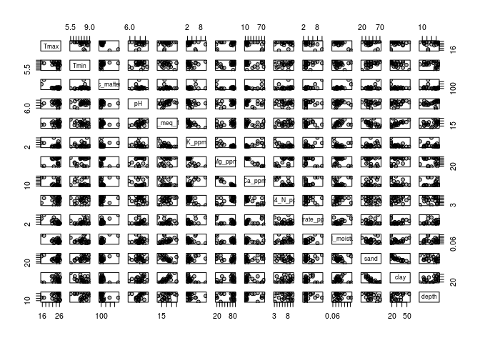
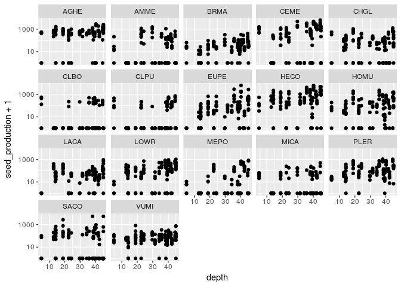

Here I begin to recreate the dummy analyses presented in [this
document](dummy-dataset-analysis.md)

    library(tidyverse); theme_set(theme_bw())

    ## ── Attaching packages ──────────────────────────────────────────────────────────────────── tidyverse 1.2.1 ──

    ## ✔ ggplot2 2.2.1     ✔ purrr   0.2.4
    ## ✔ tibble  1.4.2     ✔ dplyr   0.7.4
    ## ✔ tidyr   0.8.0     ✔ stringr 1.2.0
    ## ✔ readr   1.1.1     ✔ forcats 0.2.0

    ## ── Conflicts ─────────────────────────────────────────────────────────────────────── tidyverse_conflicts() ──
    ## ✖ dplyr::filter() masks stats::filter()
    ## ✖ dplyr::lag()    masks stats::lag()

    library(lme4)

    ## Loading required package: Matrix

    ## 
    ## Attaching package: 'Matrix'

    ## The following object is masked from 'package:tidyr':
    ## 
    ##     expand

    library(vegan)

    ## Loading required package: permute

    ## Loading required package: lattice

    ## This is vegan 2.4-6

Let's import in the performance data and clean it up to our needs.

    dat <- read_delim("~/Dropbox/spatial_tapioca/data/performance/seed_production_processed.csv", 
                      col_names = T, delim = ",")

    ## Parsed with column specification:
    ## cols(
    ##   plot_num = col_integer(),
    ##   plot_type = col_character(),
    ##   replicate = col_integer(),
    ##   sp_code = col_character(),
    ##   num_seeds_produced = col_integer()
    ## )

    ## Warning in rbind(names(probs), probs_f): number of columns of result is not
    ## a multiple of vector length (arg 1)

    ## Warning: 21 parsing failures.
    ## row # A tibble: 5 x 5 col     row col                expected               actual file              expected   <int> <chr>              <chr>                  <chr>  <chr>             actual 1  1157 num_seeds_produced no trailing characters .6664  '~/Dropbox/spati… file 2  1195 num_seeds_produced no trailing characters .9858  '~/Dropbox/spati… row 3  1197 num_seeds_produced no trailing characters .5     '~/Dropbox/spati… col 4  1206 num_seeds_produced no trailing characters .25    '~/Dropbox/spati… expected 5  1208 num_seeds_produced no trailing characters .22    '~/Dropbox/spati…
    ## ... ................. ... .......................................................................... ........ .......................................................................... ...... .......................................................................... .... .......................................................................... ... .......................................................................... ... .......................................................................... ........ ..........................................................................
    ## See problems(...) for more details.

    dat <- dat %>% filter(plot_type == "L") %>% 
      mutate(plot_num = paste0("plot_", plot_num),
                   replicate = as.factor(replicate),
                   num_seeds_produced = ifelse(is.na(num_seeds_produced), 0, num_seeds_produced)) %>%
      rename(species = sp_code, seed_production = num_seeds_produced, site = plot_num) %>% select(-plot_type)

    dat

    ## # A tibble: 2,083 x 4
    ##    site     replicate species seed_production
    ##    <chr>    <fct>     <chr>             <dbl>
    ##  1 plot_740 1         AGHE                768
    ##  2 plot_740 2         AGHE               1206
    ##  3 plot_740 3         AGHE               1425
    ##  4 plot_740 4         AGHE               1864
    ##  5 plot_740 5         AGHE               1425
    ##  6 plot_740 6         AGHE                987
    ##  7 plot_741 1         AGHE               1206
    ##  8 plot_741 2         AGHE                987
    ##  9 plot_741 3         AGHE                548
    ## 10 plot_741 4         AGHE               1206
    ## # ... with 2,073 more rows

    gg_raw_seed <- ggplot(dat) + geom_boxplot(aes(site,seed_production+1)) + 
      facet_wrap(~species, ncol = 5) + scale_y_log10()
    gg_raw_seed

    gg_rawseed_hist <- ggplot(dat) + geom_histogram(aes(seed_production+1))
    gg_rawseed_hist + scale_x_log10() # Note logged X-axis

    ## `stat_bin()` using `bins = 30`. Pick better value with `binwidth`.

Now we import the environmental data

    env_dat <- read_delim("~/Dropbox/spatial_tapioca/data/environmental/all_environmental_data.csv", 
                          delim = ",") 

    ## Parsed with column specification:
    ## cols(
    ##   .default = col_double(),
    ##   plot = col_integer(),
    ##   type = col_character(),
    ##   organic_matter_ENR = col_integer(),
    ##   Nitrate_ppm = col_integer(),
    ##   sand = col_integer(),
    ##   clay = col_integer(),
    ##   microsite = col_character()
    ## )

    ## See spec(...) for full column specifications.

    env_dat <- env_dat %>% rename(site = plot) %>% mutate(site = paste0("plot_", site))
    skimr::skim(env_dat)

    ## Skim summary statistics
    ##  n obs: 24 
    ##  n variables: 20 
    ## 
    ## Variable type: character 
    ##   variable missing complete  n min max empty n_unique
    ##  microsite       0       24 24   7  11     0        2
    ##       site       0       24 24   8   8     0       24
    ##       type       0       24 24   5   5     0        2
    ## 
    ## Variable type: integer 
    ##            variable missing complete  n   mean    sd p0    p25 median p75
    ##                clay       0       24 24  30.17 10.52 18  21.5    28    38
    ##         Nitrate_ppm       0       24 24   4.17  1.95  2   3       3     5
    ##  organic_matter_ENR       0       24 24 117.29 42.51 83 100.75  105   118
    ##                sand       0       24 24  44.88 12.97 19  37      44.5  54
    ##  p100     hist
    ##    55 ▇▅▃▃▂▃▁▁
    ##    10 ▇▂▁▁▁▁▁▁
    ##   290 ▇▃▁▁▁▁▁▁
    ##    71 ▁▃▃▇▁▃▂▂
    ## 
    ## Variable type: numeric 
    ##       variable missing complete  n    mean       sd       p0      p25
    ##         Ca_ppm       0       24 24   29.75  23.43     10       12.57 
    ##   CEC_meq_100g       0       24 24   19.69   4.51     11.2     16.65 
    ##          depth       0       24 24   29.68  12.32      4.9     18.9  
    ##            ele       0       24 24  613.74 162.43    359.55   413.38 
    ##          K_ppm       0       24 24    3.51   1.92      1.8      2.27 
    ##            lat       0       24 24   34.73   0.015    34.7     34.72 
    ##            lon       0       24 24 -120.03   0.0098 -120.05  -120.04 
    ##         Mg_ppm       0       24 24   63.71  25.97     17.3     38.55 
    ##      NH4_N_ppm       0       24 24    7.01   2.08      3        5.88 
    ##             pH       0       24 24    6.95   0.4       5.9      6.77 
    ##  soil_moisture       0       24 24    0.1    0.03      0.058    0.085
    ##           Tmax       0       24 24   23.81   2.7      15.5     23.05 
    ##           Tmin       0       24 24    7.6    0.86      5.5      7.29 
    ##    median     p75    p100     hist
    ##    16.7     46.32   77.5  ▇▁▁▁▁▁▁▂
    ##    19.95    22.5    29.9  ▅▃▇▇▆▅▁▃
    ##    32.85    39.6    45    ▁▅▂▃▁▂▇▇
    ##   718.96   728.8   734.36 ▂▂▁▁▁▁▁▇
    ##     2.95     3.78   10.1  ▇▅▁▂▁▁▁▁
    ##    34.74    34.74   34.74 ▁▁▁▁▁▁▁▇
    ##  -120.03  -120.03 -120.02 ▂▁▁▁▁▁▁▇
    ##    77.9     82.48   87.5  ▃▁▂▁▁▁▃▇
    ##     7        8.7    10    ▂▃▁▅▅▁▇▃
    ##     6.95     7.2     7.7  ▁▁▁▇▇▇▅▁
    ##     0.093    0.11    0.19 ▃▇▅▃▁▁▁▁
    ##    24.98    25.37   26.32 ▁▁▁▁▁▂▂▇
    ##     7.61     8.2     8.9  ▁▂▂▁▇▅▅▅

    plot(env_dat %>% select(-site, -lat, -lon, -type, - microsite, -ele), 
         pch = 21, bg = alpha("black", .25))

Before going too far into the models, let's do an NMDS- there's a lot of
soil variables to consider, so it might be wise to reduce dimensionality
if there are colinear columns.

    # Subset the dataset to filter out some of the columns that are factors, or are repetitive...
    env_dat_c <- env_dat %>% select(-type, -microsite, -lat, -lon, -Tmin, -ele) %>% 
      as.data.frame %>% tibble::column_to_rownames("site") 
    soilmds <- metaMDS(env_dat_c)

    ## Square root transformation
    ## Wisconsin double standardization
    ## Run 0 stress 0.09565685 
    ## Run 1 stress 0.1063597 
    ## Run 2 stress 0.09565685 
    ## ... Procrustes: rmse 8.652316e-06  max resid 1.667766e-05 
    ## ... Similar to previous best
    ## Run 3 stress 0.1052482 
    ## Run 4 stress 0.09565686 
    ## ... Procrustes: rmse 3.079129e-05  max resid 5.951174e-05 
    ## ... Similar to previous best
    ## Run 5 stress 0.1062065 
    ## Run 6 stress 0.1063597 
    ## Run 7 stress 0.09983739 
    ## Run 8 stress 0.1052481 
    ## Run 9 stress 0.1063597 
    ## Run 10 stress 0.09983735 
    ## Run 11 stress 0.09983736 
    ## Run 12 stress 0.09983735 
    ## Run 13 stress 0.1063597 
    ## Run 14 stress 0.09983735 
    ## Run 15 stress 0.09983738 
    ## Run 16 stress 0.09983735 
    ## Run 17 stress 0.3782835 
    ## Run 18 stress 0.09983759 
    ## Run 19 stress 0.09983738 
    ## Run 20 stress 0.1063597 
    ## *** Solution reached

    plot(soilmds)
    orditorp(soilmds, display="species", cex = 1.2)

    plot(soilmds)
    orditorp(soilmds, display="sites")

    # Merge in the MDS scores into the env_dat dataframe
    env_dat <- left_join(env_dat, soilmds$points %>% as.data.frame %>% tibble::rownames_to_column("site"))

    ## Joining, by = "site"

    # Take a look at what the distribution looks like. 
    skimr::skim(env_dat %>% select(MDS1, MDS2))

    ## Skim summary statistics
    ##  n obs: 24 
    ##  n variables: 2 
    ## 
    ## Variable type: numeric 
    ##  variable missing complete  n     mean    sd     p0    p25  median   p75
    ##      MDS1       0       24 24  2.2e-18 0.092 -0.097 -0.06  -0.042  0.041
    ##      MDS2       0       24 24 -1.2e-18 0.053 -0.099 -0.035 -0.0013 0.031
    ##  p100     hist
    ##  0.2  ▅▇▁▂▁▁▁▂
    ##  0.13 ▁▆▃▆▇▁▁▂

    # Merge in the environmental data with the performance-by-site data, for easier modeling later. 
    merged_df <- left_join(dat, env_dat)

    ## Joining, by = "site"

Let's do some exploratory plotting of seed production vs. environmental
factors

    gg_seed <- ggplot(merged_df, aes(y = seed_production+1)) + 
      facet_wrap(~ species, ncol = 5) + scale_y_log10()

    gg_seed + geom_point(aes(x = depth))

    gg_seed + geom_point(aes(x = Tmax))

    gg_seed + geom_point(aes(x = organic_matter_ENR))

    gg_seed + geom_point(aes(x = pH))

    gg_seed + geom_point(aes(x = CEC_meq_100g))

    gg_seed + geom_point(aes(x = soil_moisture))

    gg_seed + geom_point(aes(x = Nitrate_ppm))

    gg_seed + geom_point(aes(x = Mg_ppm))

    gg_seed + geom_point(aes(x = Ca_ppm))

    gg_seed + geom_point(aes(x = sand))

    gg_seed + geom_point(aes(x = NH4_N_ppm))

    gg_seed + geom_point(aes(x = MDS1))

    gg_seed + geom_point(aes(x = MDS2))

And let's do a first pass on modeling seed production as a function of
each environmental variable independently.

    glmer(data = merged_df, formula = seed_production~depth + (1|species), family = poisson(link = log))
    glmer(data = merged_df, formula = seed_production~Tmax + (1|species), family = poisson(link = log))
    glmer(data = merged_df, formula = seed_production~organic_matter_ENR + (1|species), family = poisson(link = log))
    glmer(data = merged_df, formula = seed_production~pH + (1|species), family = poisson(link = log))
    glmer(data = merged_df, formula = seed_production~CEC_meq_100g + (1|species), family = poisson(link = log))
    glmer(data = merged_df, formula = seed_production~soil_moisture + (1|species), family = poisson(link = log))
    glmer(data = merged_df, formula = seed_production~Nitrate_ppm + (1|species), family = poisson(link = log))
    glmer(data = merged_df, formula = seed_production~Mg_ppm + (1|species), family = poisson(link = log))
    glmer(data = merged_df, formula = seed_production~Ca_ppm + (1|species), family = poisson(link = log))
    glmer(data = merged_df, formula = seed_production~sand + (1|species), family = poisson(link = log))
    glmer(data = merged_df, formula = seed_production~NH4_N_ppm + (1|species), family = poisson(link = log))
    glmer(data = merged_df, formula = seed_production~MDS1 + (1|species), family = poisson(link = log))
    glmer(data = merged_df, formula = seed_production~MDS2 + (1|species), family = poisson(link = log))
