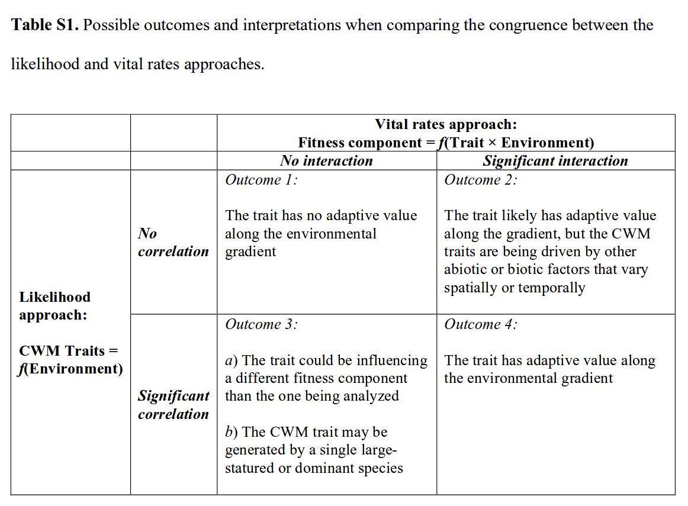

## Motivating questions 

Plant performance often varies over space, but species often vary in how they respond to the same underlying variation. In this project I aim to describe *which* environmental layers plant performance (as meaured by the seed production of 17 annual plant species in the absence of competitors) responds to across Sedgwick reserve. This analysis will be done across the whole dataset ("Which environmental layers are annual plants responding to at Sedgwick?"). 

The second question will be based on the observation in nature (and in our dataset) that plant species don't all have the same response to environmental variation-- for example, some species achieve their maximal performance in different places. To explore this further, I will ask whether there is significant species variation in their response to the same environmental conditions (their "functional response"), and which environmental layers these species are segregating on. 

The third question will explore whether species functional traits help explain variation in species' functional response to the environment. 

----------------------------

## 22 Feb 2018- more thinking about the motivation

Since there's a ton of dimensionality to these models, and since I'm getting a little distracted by just running various models, I'm taking yet another step back and jotting down some thoughts on the aims, modeling approaches, potential ways to focus our analyses and simplify the data set, and limitations of the data set. To do this it's worth going back to the motivations for this study. 

## Motivation in functional trait ecology  
[Shipley et al. 2016](https://link.springer.com/article/10.1007/s00442-016-3549-x) note that a "Foundational claim" of the functional trait paradigm is that "Functional traits show general predictive relationships to measurable environmental gradients." In other words, similar environmental conditions should tend to select for a similar distribution of traits (of "response traits"). This prediction is frequently borne out by observational studies that find shifts in community-weighted mean trait values along gradients- for example, Nathan's 2008 Science paper showed turnover in functional traits within Yasuni in ways that "made sense" given the abiotic environmental variation. But on the whole, we lack generalizable relationships that underlie such patterns- for example, although 'more fertile' soils are predicted to be dominated by species with 'resource-acquisitive' traits, it's unclear how this breaks down demographically. And it's important to get this right- because ecologists have, in the past, predicted (assumed?) that community-weighted mean traits signify the adaptive value of traits at an environment, and extend this to make predictions about the performance of species along environmental gradients (e.g. "species with traits matching the CWM trait of a site will perform well at that site, if they manage to disperse in".) As I wrote in my quals proposal, this can set us up with a few competing hypotheses:  

**H0**: Species may respond identically to environmental variation, irrespective of functional traits. We may expect this pattern if the environmental gradient spans a single stress gradient axis such that all species perform poorly at some sites and well at others. In this case, observed patterns of species turnover across the landscape at Sedgwick may be driven by poor dispersal.   
**H1**: Species may have idiosyncratic responses to the environmental gradient, but the response may be unrelated to functional traits. There is potential for environmental variation to promote species coexistence, but the stability of coexistence would be uncorrelated to species' functional similarity.  
**H2**: Variation in responses of species to environmental gradients may be explained by their functional traits. This pattern might arise if the functional traits are indicative of species' environmental preference along the gradient sampled.  
**H3**: Similarity in some traits may correlate with similarity in response to certain environmental variables. For example, drought tolerance may predict demographic responses to an aridity gradient but not to a light gradient, and seed size may predict responses to a soil texture gradient but not an aridity gradient. 

**Note**: Having recently read parts of Hilborn and Mangel's *The Ecological Detective*, I feel compelled to speak a bit in their language. The fundamental *hypothesis* of trait based ecology is that measurable functional traits, which capture some aspect of a species' ecological strategy, influence the distrubition and abundance of the species in predictable ways. With sufficient information about a species' traits, we should be able to predict its distribution, abundance, and response to the environment; and conversely with enough information regarding the environment of a location, we should be able to predict the distribution of traits that are found in that place. There's a number of competing *models* we can use to test various parts of this framework; my goal here is to build those reasonable models and test them against one another. We have predictions about which will best describe what is going on in the environment, and model selection will either hold up our expectations or suggest alternatives.

-------------------

Before getting too deep into the specifics of the data we have from Sedgwick, I want to consider a recent paper by [Laughlin et al.](http://onlinelibrary.wiley.com/doi/10.1111/ele.12781/full) titled "Survival rates indicate that correlations between community weighted mean traits and environments can be unreliable estimates of the adaptive value of traits." Laughlin et al. address the same core questions as the ones I am interested in, by testing whether three core traits- SLA, SRL, and phenology- a) have CWM turnover across environment, and b) whether models of species survival as a function of size, environment, traits, and the trait X environment interaction yield the same ecological interpretation as the CWM results. Laughlin sets up four possible outcomes in this analysis:  

  1. There is now shift in CWM along the gradient, and there's no influence of the trait on vital rates along the gradient.  
  2. CWM shifts along the gradient, but the effect of traits on vital rates is dependent on the environment.  
  3. CWM does not shift along the gradient, but the effect of traits on vital rates appears to depend on the environmental context.  
  4. Both CWM and trait-vital rate analyses suggest adaptive value of the trait. 
  
The contrasting scenarios are summarized neatly in their Table S1:  

I'll come back to their methods in a bit, but for now I focus on their results and how they interpret things.

### SLA
CWM SLA was not related to sand content or to C:N ratio. In the survival analysis, the interaction term between SLA and sand content was not significant, but there was a significant interaction between SLA and C:N ratio- in High C:N ratio, survival was highest for species with low SLA and conversely. This interaction was a "strong" interaction (more on this later.)  

### SRL
CWM SRL was positively related to sand content. In survival analysis, there was a significant interaction between SRL and soil sand content, such that survival was highest for species with low SRL in soil with low sand content. This is in agreement, with the caveat that the survival analysis result was not that of a  "strong" interaction. CMW SRL was also negatively to soil C:N ratio, the interaction between SRL and soil C:N in survival analysis was not significant. 

### Flowering date
CWM flowering date was positively related to sand content. In the survival analysis, there was a significant interaction between flowering date and sand content, such that survival was higher for species with later flowering dates in sandy soils and lower for species with early flowering in sandy soil. This was a "strong" interaction. CWM flowering date was also negatively related to soil C:N ratio, but the interaction term between flowering date and soil C:N ratio was not significant, which is a conflicting result. 

### Discussion
No trait exhibited independent main effects of survival because the adaptive value of traits depended on the environmental context. 

-----------------------------

It's worth keeping this paper in mind as I think more about what I'm doing here. I will run the code in their supplement to get a greater sense of what they're up to. 